# Introduction

This course is about uncertainty quantification (UQ) in numerical simulation.

The two actors in the play are the *models* and the *uncertainties*. 

## Uncertainties and models

A first question arises:

??? question "What is a model?"

    In this course,
    a model is a function $f$:

    - representing a causal phenomenon,
    - with input variables $x\in\mathcal{X}$,
    - with output variables $y:=f\left(x\right)\in\mathcal{Y}$.

    These input and output variables can be 
    
    - either monodimensional, 
      *e.g.* the temperature at given location and time,
    - or multidimensional, 
      e.g. the temperature at various points along a line, 
      the temperature at various nodes of a spatial mesh,
      the temperature at a given location every minut,
      etc. 

    Among the outputs, some may interest us more than others: these are the quantities of interest.

    ??? example "Examples of models"

        - An analytical expression such as $f(x)=\pi x^2$ to compute the area enclosed by a circle of radius $x$,
        - a numerical simulator such as the Simulink-Matlab model of an electromagnetic interference (EMI) filter, 
        - a measurement process such as a test campaign based on an experimental design of experiments (DOE), 
        - ...

    Advantages:

    - Explainable because it is based on physical theories or measurements.
    - Good accuracy level w.r.t. the modelled phenomenon.

    !!! example "Applications"

        - Design optimization, 
        - trade-off studies, 
        - reliability, 
        - understanding of complex phenomena, 
        - ... 
        
        More generally, computer experimentation (*in silico* vs. *in situ*).

followed by a second one:

??? question "What is uncertainty? What are uncertainties?"

    - "A situation in which something is not known, or **something that is not known or certain**." - Cambridge dictionary
    - "The feeling of not being sure what will happen in the future." - Cambridge dictionary
    - "**The state of being uncertain**." - Oxford Learner's Dictionaries
    - "Something that you cannot be sure about; a situation that makes you not be or feel certain" - Oxford Learner's Dictionaries

## Where do uncertainties come from?

A model faces uncertainties on all sides.

### In the equations
- Simplification of the physical phenomenon.
- Different theories and assumptions.

### In the numerical resolution
- Numerical approximation of partial differential equations.
- Different methods, mesh sizes, ...
- Numerical noise in addition.

### In the model inputs
- Uncertain data (initial and boundary conditions, calibration data, ...).
- Uncertain parameters (dimensions, physical properties, ...).

Subject to these uncertainties, 
the model generates an output that is in turn uncertain.

## Types of uncertainties

### Epistemic vs. aleatory

Because these uncertainties have different types,
we may want to classify them in order to propose specific analyses.

We often consider two types of uncertainties: aleatory and epistemic.

??? question "What is an aleatory uncertainty?"

    - An aleatory uncertainty is intrinsic to the parameter to which it relates. 
    - An aleatory uncertainty is irreducible.
    - An aleatory uncertainty can be estimated by means of experimental measures.
    - Its modelling is mainly based on probability theory and inferential statistics.

??? question "What is an epistemic uncertainty?"

    - An epistemic uncertainty is due to a lack of knowledge.
    - An epistemic uncertainty could be reducible.
    - Knowledge is often subjective and based on expert opinion, 
      either quantitative or qualitative.
    - Their modelling can rely on different uncertainty theories (possibility, credibility, probability, ...) 
      but mainly based on probability theory for simplicity.

### Probability & epistemic?

!!! example "Cycling race"

    - $N$ cyclists.
    - Who is going to win the race?
    - A first person says "They have the same level!".
    - A second person says "No idea!", 
      which means that "The $i^{\text{th}}$ cyclist with probability $\frac{1}{N}$.".

    ??? question "What is the probability that the $i^{\text{th}}$ cyclist wins?"

        $\frac{1}{N}$ in both cases! 
        For the first one, it's obvious 
        and for the second one, we use the principle of insufficient reason, a.k.a. principle of indifference.
        As we can see, 
        natural language sentences are very different
        but identical in probabilistic language.

!!! example "Color balls in the box"
  
    1. A box contains at least as many blue balls as red balls.
    2. This box contains at most twice as many blue balls as red balls.

    ??? question "What is the probability that the box contains at most 50% more blue balls than red balls?"

        1. This probability can be written as $\mathbb{P}[n_b\leq \frac{3}{2}n_r]$.
        2. Points 1 and 2 can be translated as $n_b\geq n_r$ and $n_b\leq 2n_r$ respectively.
        3. The principle of insufficient reason applied to $n_b$ supposes that $n_b$ is a uniform variable between $n_r$ and $2n_r$.
           So, $\mathbb{P}[n_b\leq \frac{3}{2}n_r]=\frac{\frac{3}{2}-1}{2-1}=\frac{1}{2}$.
           But this principle applied to $n_r$ supposes also that $n_r$ is a uniform variable between $\frac{1}{2}n_b$ and $n_b$
           So, $\mathbb{P}[n_b\leq \frac{3}{2}n_r]=\mathbb{P}[n_r\geq \frac{2}{3}n_b]=\frac{1-\frac{2}{3}}{1-\frac{1}{2}}=\frac{2}{3}$.
           The probability is equal to both $\frac{1}{2}$ and $\frac{2}{3}$, which makes no sense.

### Uncertainty modelling
[Frequentist probability theory](https://en.wikipedia.org/wiki/Frequentist_probability) is mainly used to model aleatory uncertainties.

We can use 
[Bayesian probability theory](https://en.wikipedia.org/wiki/Bayesian_probability), 
[evidence theory](https://en.wikipedia.org/wiki/Dempster%E2%80%93Shafer_theory), 
etc. to model epistemic uncertainties.

In the case of evidence theory, 

- experts can provide plausible and believable values for the epistemic parameters 
  and these expert opinions can be aggregated. 
- Then, 
  a first uncertainty study based on the aleatory uncertainties can be realized 
  with the epistemic uncertainties fixed at their believable values 
  and a second one with the epistemic uncertainties fixed at their plausible values. 
- Lastly, 
  both believable, plausible and [pignistic](https://en.wikipedia.org/wiki/Pignistic_probability) uncertainty study results are obtained 
  rather than a single one in the case where all uncertainties would be treated as aleatory variables. 
- In practice, 
  an uncertainty study result could be the estimated probability density function of the model output.

In practice, 

- epistemic uncertainties are often treated with the frequentist probability theory,
- the distinction between epistemic and random uncertainties is not always easy to make or engraved in stone...

## Why study the effect of uncertainties?

### The uncertain world

Let's consider a model $f$:

- depending on input variables $x=(x_1,\ldots,x_d)$,
- returning an output variable $y=f(x)$.

In the deterministic world, $y$ is a variable of interest.

In a uncertain world, 
when the value of $x$ is uncertain, 
we can

1. replace $x$ by a random variable $X$,
   *e.g.*, $X_1$ distributed as a [Gaussian variable](https://en.wikipedia.org/wiki/Normal_distribution), 
   $X_2$ distributed as a [uniform variable](https://en.wikipedia.org/wiki/Continuous_uniform_distribution), ...
2. quantify the impact of $X_1,\ldots,X_d$ on the model output $Y=f(X)$ which is in turn random.

### Which impact on the model output?

We are then interested in the variability of $Y$ caused by the variability of $X$.
Unfortunately, 
the probability distribution of $Y$ is often unknown
and potentially far from the classic probability distributions 
([normal](https://en.wikipedia.org/wiki/Normal_distribution), 
[exponential](https://en.wikipedia.org/wiki/Exponential_distribution), 
[log-normal](https://en.wikipedia.org/wiki/Log-normal_distribution), 
[uniform](https://en.wikipedia.org/wiki/Continuous_uniform_distribution), ...).

In practice, we want to summarize the output uncertainty with a quantity of interest:

- a central statistics of $Y$, *e.g.* its [mean](https://en.wikipedia.org/wiki/Expected_value), 
  its [median](https://en.wikipedia.org/wiki/Median), 
  its [standard deviation](https://en.wikipedia.org/wiki/Standard_deviation), ...
- a reliability measure of $Y$, *e.g.* the probability that it exceeds a critical threshold, the quantile associated to some critical level, ...
- sometimes, the whole [probability distribution](https://en.wikipedia.org/wiki/Probability_distribution) of $Y$!

There is a question in particular: 
> How do the input uncertainties $X$ impact the model output $Y$?        

!!! question "Does the output remain close to its nominal value?"

    - Is the variance of $Y$ small or not?
    - Is the variation coefficient of $Y$ small or not?
    - Is the probability that $Y$ exceeds a threshold small or not?
    - Is green or red?

    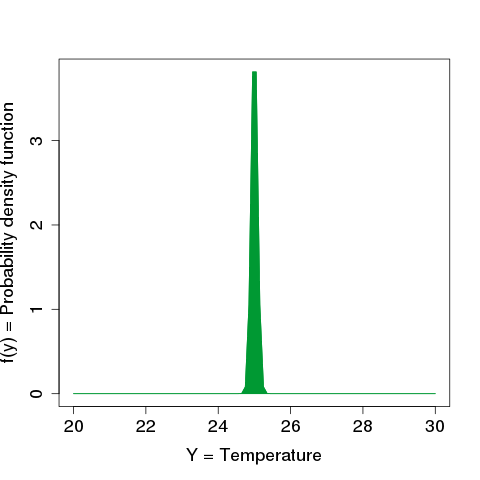
    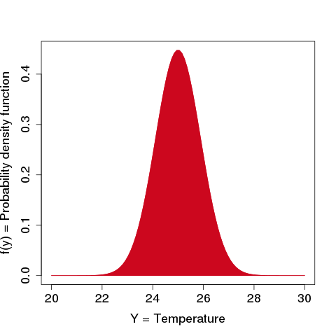
    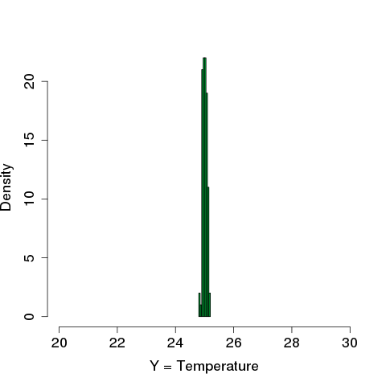
    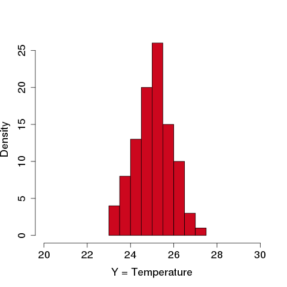
    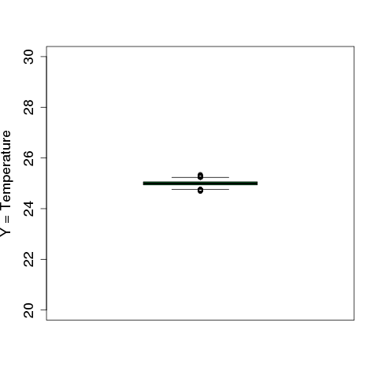
    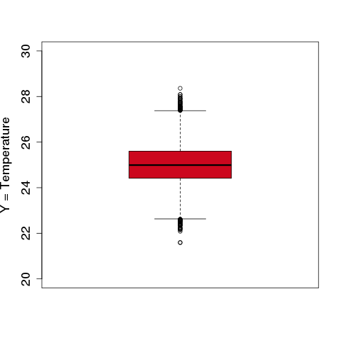

!!! question "Is the risk that the output exceeds a critical threshold important?"
    

    1. For **any** input $x_i$ subject to a small variation $\delta x_i$,
       the output variation $\Delta y$ is **small**.
    2. There is **an** input $x_i$ subject to a small variation $\delta x_i$
       for which the output variation $\Delta y$ is **important**.

    Which assertion is true?

!!! question "Is the risk that the output exceeds a critical threshold important?"

    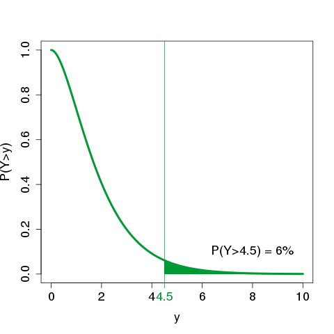
    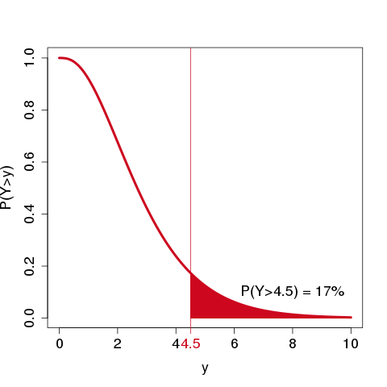

!!! question "How is the output uncertainty explained by the inputs?"

    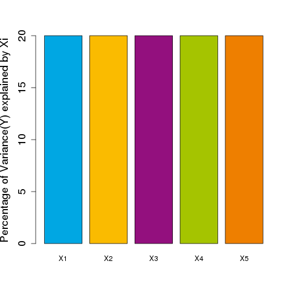
    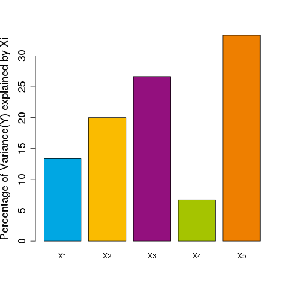

!!! question "Which input uncertainties should we reduce?"

    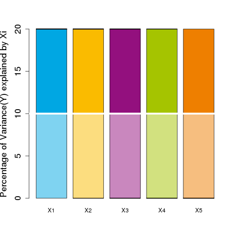
    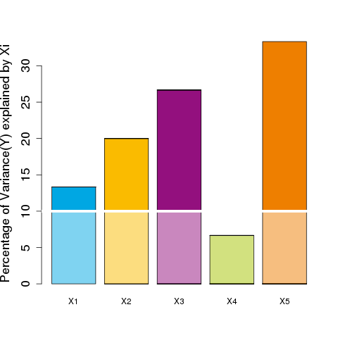

## UQ&M as an industrial solution

The problem that emerges is the management of uncertainties in a model.

We want to

- understand the uncertainty present in the output of a model,
- link this uncertainty to the uncertain input sources,
- identify the more significant uncertain input sources,
- reduce some uncertainty sources if possible.

A solution to this problem is called *uncertainty quantification & management* (UQ&M),
often abbreviated to UQ.
UQ is an engineering domain in its own right, 
requiring knowledge of the fields to which it applies.

Based on industrial practices,
four categories can be listed[@rocquigny2009quantifying]
in which to place of the goals of any quantitative risk/uncertainty assessment:
 
??? info "U (Understand)"

    Understand the influence or rank of importance of uncertainties helps to 
    guide the new measurements or the computer modeling and the R&D efforts.

??? info "A (Accredit)"

    Give credit to a model or a method of measurement 
    and reach an acceptable quality level for its use, 
    by fixing some model inputs, 
    estimating parameters of other inputs, 
    reducing the output uncertainty, ... 
    or even updating the uncertainty model through dynamic data assimilation.

??? info "S (Select)"

    The consideration of uncertainties allows to compare different system performances 
    and optimize the choice of the objective policy, operation or design of the system.

??? info "C (Comply))"

    Defining an adequate criterion or regulatory threshold (*e.g.* licensing, certification, ...) 
    taking into account the uncertainties allows to demonstrate compliance of the system.

A popular scheme is available
to summarize a UQ&M study from a number of generic tasks:

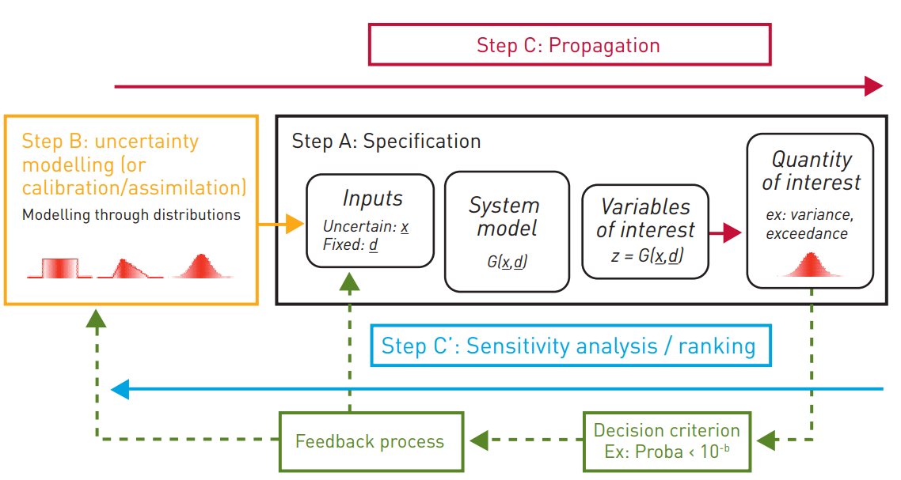

## Surrogate models as UQ&M enablers

UQ&M techniques tools often require an important number of model evaluations 
to estimate quantities of interest such as quantiles or probabilities.

But in many cases,
model evaluation are expensive or time-consuming
and in these cases,
precise estimation of these quantities is impossible.

To carry out UQ studies in spite of this,  
models are commonly replaced by so-called *surrogate models*
which are inexpensive to evaluate.

These surrogate models are often designed using machine learning techniques.
