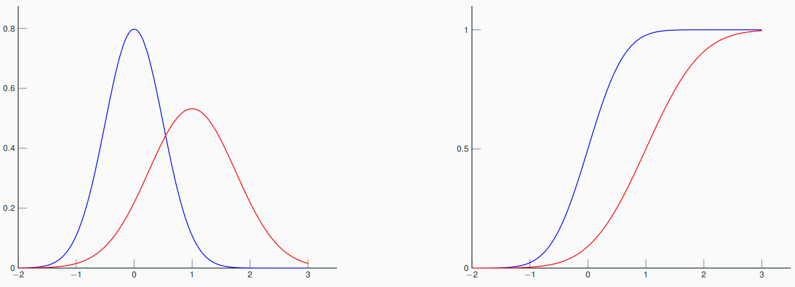
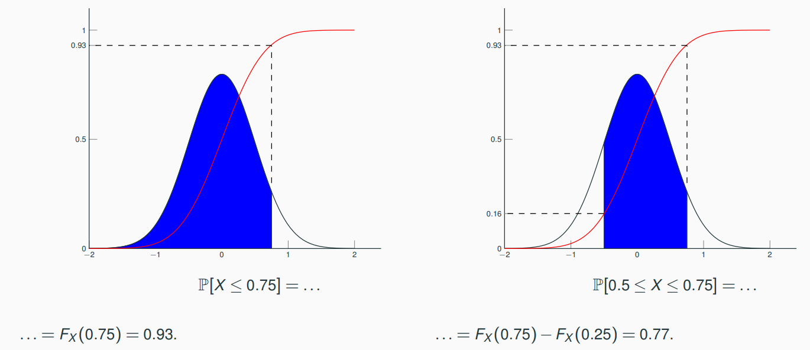

# 2. Basics of probability

## Variable vs. random variable

### Variable

A variable is the property of an object resulting of an experiment. 
e.g. the size of a person where the object is the medical check-up and the experiment is the patient consultation
(the patient's shoes are not a variable but a parameter).

!!! warning

    A variable is not a parameter.
    By definition, 
    a variable *varies* while a parameter is fixed.

Quantitative variable:

- Discrete variable - A variable with discrete values, e.g. building floor.
- A continuous variable - A variable with continuous values, e.g. building height.
 
Qualitative variable:

- Nominal variable - A variable with nominal values, e.g. curry dish.
- Ordinal variable - A variable with ordinal values, e.g. spice level.

### Random variable

A random variable is the property of an object resulting of a random experiment,
e.g. the size of an adult person among a given population.

## Random experiment

A random experiment is a real-world process whose state is random,
e.g. obtaining the monthly water requirements per hectare [mwrph] (= the real-world process) 
of a field (= the state) 
in the south-west of France (= randomness). 

A random experiment can be modelled by a probability space $(\Omega,\mathcal{F},\mathbb{P})$ where

- the population $\Omega$ is the set of all possible outcomes of the experiment,
  a.k.a. sample space or possibility space,
  e.g. the mwrph of all the fields of the SW of France,
- an element $\omega$, a.k.a. realization $\omega$, is any element of the population $\Omega$,
  e.g. the mwrph of a particular field in the SW of France,
- an event $A$ is a set of possible elements, subset of the population $\Omega$, 
  the set of all events is noted $\mathcal{F}$,
  e.g. the mwrph of fields of more than 500 hectares in the SW of France,
- the probability $\mathbb{P}$ is the measure of the likelihood that an event happens,
  e.g. the mwrph of the field of the Dupont family at Joli-Village-Sur-Garonne exceeds the one of 2020.
  $\mathbb{P}$ is an application from $\Omega$ to $[0,1]$ 
  such that $\mathbb{P}(\Omega)=1$ and $\mathbb{P}(\cup_{i\geq 1}A_i)=\sum_{i\geq 1}\mathbb{P}(A_i)$ iff $\forall i\neq j, A_i \cap A_j=\emptyset$. 

## Sampling

A sample is an observation of the random variable $X$ over the population $\Omega$. 
The rest of the population remain unknown.

Notations:

- $X$ - Random variable
- $x$ - Observed value of the random variable $X$
- $X^{(i)}$ - The $i^{\text{th}}$ observation of the random variable $X$.
- $x^{(i)}$ - The $i^{\text{th}}$ observed value of the random variable $X$.

!!! warning

    An observation is a random variable contrary to an observed value.

## Probability distribution

### Cumulative distribution function (CDF)
$$
\begin{aligned}
F_X:\mathcal{X}\subseteq\mathbb{R}&\rightarrow[0,1]\\
x&\mapsto F_X(x)=\mathbb{P}[X\leq x]
\end{aligned}
$$

- Discrete variable: $F_X(x)=\sum_{u\in\mathcal{X},~u\leq x}\mathbb{P}[X=u]$
- Continuous variable: $F_X(x)=\int_0^xf_X(u)du$

Properties:

- non-decreasing
- right-continuous
- $\lim_{x\rightarrow -\infty}F_X(x)=0$
- $\lim_{x\rightarrow +\infty}F_X(x)=1$

### Probability density function (PDF)

If there is a positive and integrable function $f_X$ such that 

$$\forall (a,b)\in\mathbb{R}^2, ~\mathbb{P}[a\leq X\leq b]=\int_a^bf_X(x)dx.$$

then

$$\mathbb{P}[X \in I\subseteq\mathcal{X}\subseteq\mathbb{R}]=\int_{I} f_X(x)dx$$

where

$$f_X(x)=\frac{d}{dx}F_X(x)$$

Properties:

- $\forall x\in\mathcal{X},~f_X(x)\geq 0$
- $\int_{\mathcal{X}}f_X(x)=1$
- $\lim_{x\rightarrow \pm \infty} f_X(x)=0$

!!! Example

    Two normal (a.k.a. Gaussian) distributions:
    
    | color | mean | standard deviation |
    |-------|------|--------------------|
    | blue  | 0    | 0.5                |
    | red   | 1    | 0.75               |
    
    Below the PDF on the left and the CDF on the right. 
    
    
    
    Below the relation between CDF and PDF.
    
    
