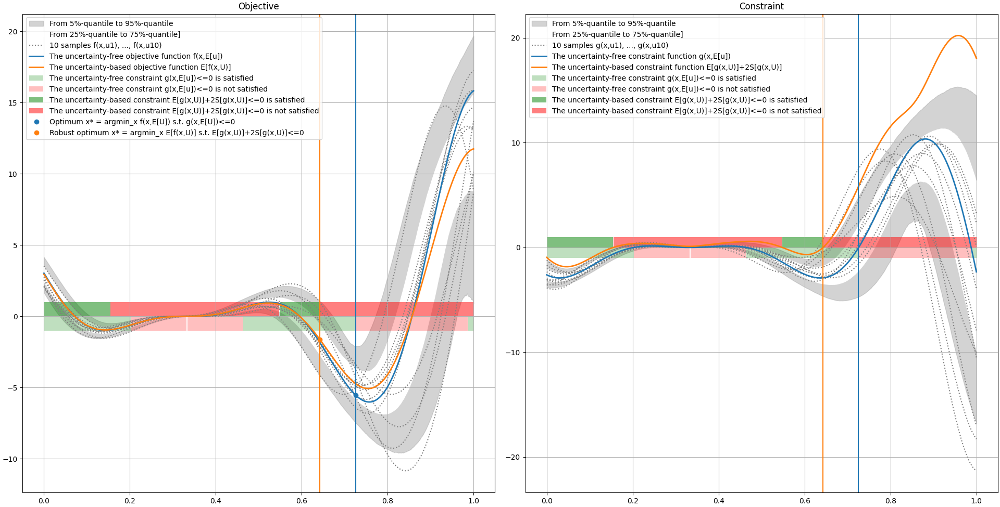

# 8. Robust optimization

## Introduction

### Optimization problem

A standard optimization problem aims to
find a vector $x^*$
minimizing an objective function $f$
over a search space $\mathcal{X}\subseteq\mathbb{R}^d$
while satisfying inequality constraints $g(x)\leq 0$
and equality constraints $h(x)=0$:

$$
\begin{align}
&\underset{x\in\mathcal{X}}{\operatorname{minimize}}& & f(x) \\
&\operatorname{subject\;to}
& &g(x) \leq 0 \\
&&&h(x) = 0
\end{align}
$$

where $f:\mathcal{X}\to\mathbb{R}$,
$g:\mathcal{X}\to\mathbb{R}^{p_g}$
and $h:\mathcal{X}\to\mathbb{R}^{p_h}$.

Any optimization problem of the form

$$
\begin{align}
&\underset{x\in\mathcal{X}}{\operatorname{minimize}}& & f_{\textrm{cost}}(x) \\
&\underset{x\in\mathcal{X}}{\operatorname{maximize}}&
& f_{\textrm{performance}}(x) \\
&\operatorname{subject\;to} & &g_n(x) \leq t_{g_n} \\
&&&g_p(x) \geq t_{g_p} \\
&&&\tilde{h}(x) = t_h
\end{align}
$$

can be reduced to such a standard optimization problem:

- an objective to minimize,
- upper inequality constraints with bounds equal to 0,
- equality constraints with right-hand sides equal to 0.

### Multidisciplinary optimization problem

In complex systems,
the quantities $f(x)$, $g(x)$ and $h(x)$ are often computed by $M$ models,
called *disciplines*,
which can be weakly or strongly coupled.
The vector $x$ can be split into

- a sub-vector $x_0$ shared by at least two disciplines,
- sub-vectors $x_{1\ldots M}=\{x_1,\ldots,x_M\}$, where $x_i$ is specific to the $i$-th discipline.

Then,
the problem can be rewritten as the multidisciplinary optimization (MDO) problem

$$
\begin{align}
&\underset{x\in\mathcal{X},\,y\in\mathcal{Y}}{\operatorname{minimize}}&&f(x,y)\\
&\operatorname{subject\;to}
& &g(x,y) \leq 0 \\
&&&h(x,y) = 0 \\
&&&y=c(x,y)
\end{align}
$$

where $c_i:x_0,x_i,y_{-i}\mapsto y_i$ represents the $i$-th discipline
with $y_{-i}=\{y_j\}_{j\in\{1,\ldots,M\}\setminus\{i\}}$.

This MDO problem implies that
the optimum $(x^*,y^*)$ must be multidisciplinary feasible,
i.e. satisfying the coupling equations $y=c(x,y)$.
Solving a non-linear equation system is called a *multidisciplinary analysis* (MDA).

Last but not least, 
the efficient resolution of an MDO problem involves finding a suitable rewriting of the problem, 
called MDO formulation or architecture.

## Optimization under uncertainty

A (multidisciplinary) optimization problem under uncertainty is a (multidisciplinary) optimization whose objective and constraints are statistics.

### Illustration

Let us consider the simple optimization problem

$$
\begin{align}
&\underset{x\in[0,1]}{\operatorname{minimize}}& & (ax-b)^2\sin(cx-d) \\
&\operatorname{subject\;to}
& &(ax-b)^2\cos(cx-d) \leq 0 
\end{align}
$$

with $a=6$, $b=2$, $c=12$ and $d=4$.
The following figure represents the objective function, the feasibility domain and the optimum:

Let us now consider the constants $a$, $b$, $c$ and $d$ as uncertain 
and model them by independent random variables $A$, $B$, $C$ and $D$ respectively. 
These random variables are distributed 
according to triangular distributions centered at their reference values with an amplitude of $\pm 15\%$.
The following figure illustrates the propagation of these uncertainties through the constraint and objective functions 
and compares the previous solution to the solution of the optimization problem under uncertainty:

$$
\begin{align}
&\underset{x\in[0,1]}{\operatorname{minimize}}& & \mathbb{E}[(Ax-B)^2\sin(Cx-D)] \\
&\operatorname{subject\;to}
& &\mathbb{E}[(Ax-B)^2\cos(Cx-D)]+2\mathbb{S}[(Ax-B)^2\cos(Cx-D)] \leq 0 
\end{align}
$$

First, 
we can see that the average value of the objective function has increased (blue curve to orange curve) 
without shifting its constraint-free minimum argument around 0.75. 
On the other hand, 
the feasibility domain has decreased (from semi-opaque red and green zones to less opaque red and green zones), 
forcing the solution to shift to the left (from blue vertical line and dot to orange vertical line and dot).

### Probabilistic framework

The models are often subject to uncertainty sources $U$, represented by random variables.
Then,
the objective $f(x,U)$ and the constraints $g(x,U)$ and $h(x,U)$,
where $U$ denotes random inputs,
are in turn random variables
and the standard optimization problem is replaced by

$$
\begin{align}
&\underset{x\in\mathcal{X}}{\operatorname{minimize}}& & \mathbb{K}_f[f(x,U)] \\
&\operatorname{subject\;to}
& &\mathbb{K}_g[g(x,U)] \leq 0 \\
&&&\mathbb{K}_h[h(x,U)] = 0
\end{align}
$$

where $\mathbb{K}_f$, $\mathbb{K}_g$ and $\mathbb{K}_h$ are statistic operators,
e.g.

- the expectation operator $\mathbb{E}$,
- the standard deviation operator $\mathbb{S}$,
- the variance operator $\mathbb{V}$,
- a margin, i.e. a combination of expectation and standard deviation operators parametrized by a weight $\kappa$: $\mathbb{E}+\kappa\cdot\mathbb{S}$,
- a probability operator $\mathbb{P}$ parametrized by bounds $m$ and $M$.

Concerning the margin,
the sign of $\kappa$ depends on the function type:

- $\kappa$ must be positive for an objective to minimize,
- $\kappa$ must be negative for an objective to maximize,
- $\kappa$ must be positive for a negativity constraint,
- $\kappa$ must be negative for a positivity constraint,
- $\kappa$ can be either positive or negative for an observable.

In practice,
the statistics $\mathbb{K}_f[f(x,U)]$, $\mathbb{K}_g[g(x,U)]$ and $\mathbb{K}_h[h(x,U)]$ are unknown
and the operators $\mathbb{K}_f$, $\mathbb{K}_g$ and $\mathbb{K}_h$ are replaced
by data-based operators $\widehat{\mathbb{K}}_f$, $\widehat{\mathbb{K}}_g$ and $\widehat{\mathbb{K}}_h$.
For example,
in the case of the expectation operator $\mathbb{E}$ and the Monte Carlo (MC) sampling technique,
the statistic $\mathbb{E}[f(x,U)]$ is replaced
by the statistic estimator $\widehat{\mathbb{E}}[f(x,U)]=\frac{1}{N}\sum_{i=1}^Nf(x,u^{(i)})$
where $u^{(1)},\ldots,u^{(N)}$ are $N$ independent realizations of $U$.

Typically,
a margin is applied to the objective to ensure a robust optimum $x^*$.
Indeed, minimizing margin $\mathbb{E}[f(x,U)]+\kappa\cdot\mathbb{S}[f(x,U)]$ pushes towards a compromise between

1. a small value of $f(x^*,u)$ by minimizing $\mathbb{E}[f(x,U)]$,
2. a small dispersion around $f(x^*,u)$ by minimizing $\mathbb{S}[f(x,U)]$.

For reliability purposes,
probabilities could be applied to inequality constraints,
e.g. $\mathbb{P}[g(x,U)\geq\epsilon]$ or $\mathbb{P}[g(x,u)>0]-\varepsilon$,
or equality constraints,
e.g. $\mathbb{P}[|h(x,U)|\geq\epsilon]$.

!!! note "Margin under normal assumption"

    When $\phi(x,U)$ is normally distributed,
    the margin $\mathbb{E}[\phi(x,U)]+q_\alpha\cdot\mathbb{S}[\phi(x,U)]$
    corresponds to the $\alpha$-quantile of $\phi(x,U)$
    where $q_\alpha$ is the $\alpha$-quantile
    of the standard Gaussian distribution.
    For that reason,
    2 or 3 are common candidates for $\kappa$
    as in this case,
    the margins correspond to
    the 0.975- and 0.999- quantiles of $\phi(x,U)$ respectively.

### Statistic estimation

Given value of the design variable $x$,
many types of estimators can be used to estimate the statistics:

- Monte Carlo and quasi Monte Carlo techniques provide unbiased estimators but require a lot of samples; 
  they cannot be used for costly disciplines; 
  e.g. $\mathbb{E}[f(x,U)]\approx E_{MC,N}[f(x,U)]=N^{-1}\sum_{i=1}^Nf(x,U^{(i)})$, 
- first-order Taylor expansions over the uncertain space 
  (ie. $f(x,U)\approx f(x,\mathbb{E}[U])+\frac{\partial f(x,\mathbb{E}[U])}{\partial x}(U-\mathbb{E}[U])$)
  can be used to approximate the expectations and variances composing many statistics in optimization under uncertainty; 
  if the models provide the gradients for cheap, 
  it is really advantageous;
  provided that the objective and constraint functions are approximately linear with respect to the uncertain variables;
- surrogate models built over either the uncertain space or both the uncertain and design spaces;
- variance reduction techniques, 
  such as control variates and importance sampling, 
  preserve this unbiasedness property but are more complicated to set up 
  and can still require too many samples for costly disciplines; 
  e.g. $\mathbb{E}[f(x,U)]\approx E_{MC,N}[f(x,U)]-\frac{C_{MC,N}(f,\tilde{f})}{V_{MC,N}}(E_{MC,N}[\tilde{f}(x,U)]-\mathbb{E}[\tilde{f}(x,U)])$
  where $\hat{f}$ is a cheap approximation of $f$ and $\mathbb{E}[\tilde{f}(x,U)]$ is known or can be estimated for free.
