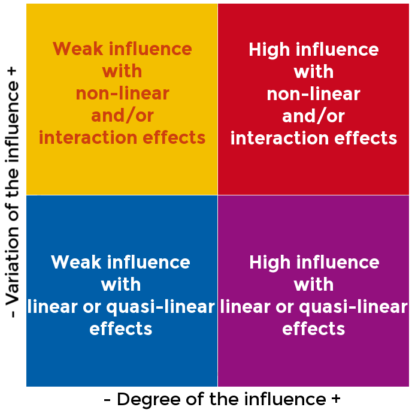
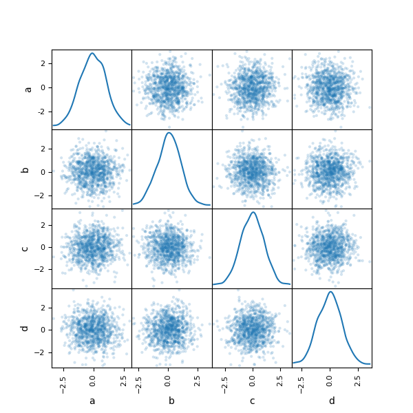
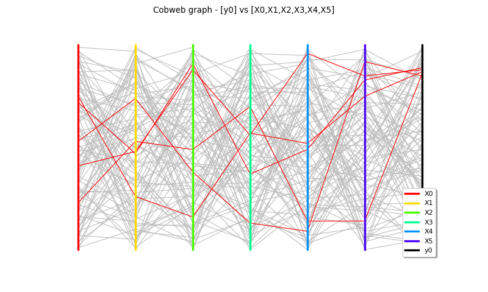
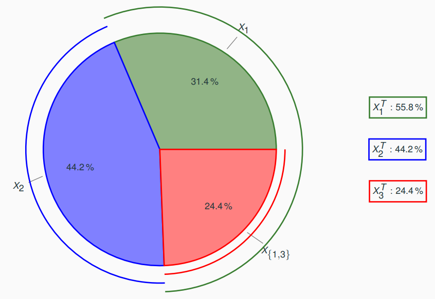
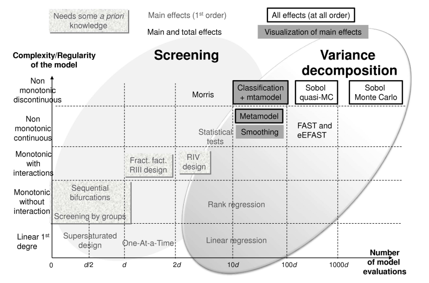

# 6. Sensitivity analysis

## What is sensitivity analysis (SA)?

- **Sensitivity** - Does the model output vary when inputs vary?
- **Sensitivity quantification** - How much does the model output vary in function of inputs variations?
- **Sensitivity analysis** - How the model output uncertainty is explained by the different uncertain inputs? Qualitatively? Quantitatively?

We aim to reduce the output uncertainty:

1. Identify the most influential inputs and the non-significant ones, 
   either around a nominal value, or over the whole input space.
2. R&D to reduce the reducible sources of uncertainty.
3. Fix the non-significant ones at nominal values.
4. Reduce the dimension of the uncertain space.
5. R&D to change the model if the model output is too much uncertain.

## Local vs. global SA

### Local SA (LSA)

We consider

$$y=f(x)=f(x_1,\ldots,x_d)$$

where $x$ and $y$ are deterministic variables.

How does $y$ vary around a nominal input $x^{(0)}$? 
Which is the most influential input?

- Mainly based on partial derivatives (or finite differences) of $f$ at $x^{(0)}$;
  we compare their absolute values.
- Conclusions depend on the choice of $x^{(0)}$ and on the discretization step $\delta x$.

### Global SA (GSA) 

We consider

$$Y=f(X)=f(X_1,\ldots,X_d)$$

where $x$ and $y$ are deterministic variables.

How does $Y$ vary over the uncertain input space $(\Omega, \mathcal{X} , \mathbb{P})$?

- Based on probabilistic distributions of $X$;
  given a dataset, we compare output statistics and compare these statistics.
- Conclusions depend on the choice of the distribution of $X$ (distributions of $X_1,\ldots,X_d$, and eventually their joint distribution).

!!! example

    $Y=f(X)=\exp(X_1)+\exp(X_2)$ with $X_1,X_2\sim_{\text{i.i.d.}}\mathcal{U}([0,1])$.

    A GSA would conclude that $X_1$ and $X_2$ have the same effect on $Y$ while a LSA would conclude that $x_1$ is more influent if $x_1>x_2$ and conversely.

## LSA

### Quadratic cumul

Let $\tilde{x}\in\mathcal{X}$ be a point of interest, e.g. $\mu=\mathbb{E}[X]$.

#### First-order Taylor polynomials

We can compute the first-order Taylor polynomial with analytic formulas, finite differences, automatic differentiation, etc.

The first-order Taylor expansion at $\tilde{x}$ can be written as

$$f(x)=f\left(\tilde{x}\right)+\sum_{i=1}^d\frac{\partial f(\tilde{x})}{\partial x_i}\left(x_i-\tilde{x}_i\right)+o\left(\left\|x-\tilde{x}\right\|\right).$$

Assuming a behavior mainly linear, the first-order Taylor polynomial reads

$$f_1(X) \equiv f\left(\tilde{x}\right)+\sum_{i=1}^d\frac{\partial f(\tilde{x})}{\partial x_i}\left(X_i-\tilde{x}_i\right)$$ 

Then,
the mean value of the random variable $Y$ is simply

$$\mathbb{E}[Y]\approx \mathbb{E}[f_1(X)]= f\left(\tilde{x}\right)$$

and the same for its variance:

$$\mathbb{V}[f(X)]\approx\mathbb{V}[f_1(X)]=\sum_{i=1}^d\left(\frac{\partial f(\tilde{x})}{\partial x_i}\right)^2\mathbb{V}[X_i]$$

where $\mathbb{V}[X_1],\ldots,\mathbb{V}[X_N]$ are known.

We can deduce from this last expression our first sensitivity indices:

$$\forall i\in\{1,\ldots,d\},\quad\text{QC}_i\left(\tilde{x}\right)=\left(\frac{\partial f(\tilde{x})}{\partial x_i}\right)^2\frac{\mathbb{V}[X_i]}{\mathbb{V}[Y]}$$

Most often, 
$\tilde{x}\equiv\mathbb{E}[X]$ 
to compare the impact of the input uncertainties on the output around the mean input value.

$$\forall i\in\{1,\ldots,d\},\quad\text{QC}_i\equiv\left(\frac{\partial f(\mathbb{E}[X])}{\partial x_i}\right)^2\frac{\mathbb{V}[X_i]}{\mathbb{V}[Y]}$$

!!! note "Pros"

    - Need only an expert knowledge of input means and variances.
    - If $X$ is Gaussian, $f(X)$ is almost Gaussian with analytic formula for mean and variance if $f$ is almost linear.

!!! warning "Cons"

    - $f$ must not be strongly non-linear.
    - For uncertainty propagation purposes, it is not possible to get the whole distribution of $Y$, except is $f$ is almost linear.

## GSA

### Morris method

From a few calls to the simulator, 
the Morris method aims at comparing the influence of the uncertain inputs on the output variability
in terms of degree of the influence of the inputs and variation of the influence over the input range.

#### One-at-A-Time (OAT) method

This method requires $d+1$ model evaluations, 
where $d$ is the input dimension,
and is very simple:

1. Select an input value $x^{(0)}$ and evaluate the model: $y^{(0)}=f\left(x^{(0)}\right)$.
2. For each input variable $X_i$, $i\in\{1,\ldots,d\}$, evaluate the model: $y^{(i)}=f\left(x^{(i)}\right)$ where $x^{(i)}_j=x^{(i-1)}_j+\tau_i\delta_{j=i}$.
3. Compare $\Delta y^{(1)},\ldots,\Delta y^{(d)}$ with $\Delta y^{(i)}=\frac{y^{(i)}-y^{(i-1)}}{\tau_i}$

#### Morris method

This method requires $R(d+1)$ model evaluations
and consists of computing statistics of the OAT technique results

1. Repeat $R$ times the OAT method with $R$ different initial values $x^{(0),[1]},\ldots,x^{(0),[R]}$
   to get $\left(\Delta y^{(1),[1]},\ldots,\Delta y^{(1),[R]}\right),\ldots,\left(\Delta y^{(d),[1]},\ldots,\Delta y^{(1),[R]}\right)$.
2. For each input variable $X_i$, 
   compute the mean value of $\Delta y^{(i)}$, noted $\mu_i^*$,
   as well as its standard deviation, noted $\sigma_i$. 
3. Compare $x_1,\ldots,x_d$ by plotting the pairs $(\mu_1^*,\sigma_1),\ldots,(\mu_d^*,\sigma_d)$.

??? tip "Equations"

    $$\mu_i=R^{-1}\sum_{r=1}^R\Delta y^{(i),[r]}$$
    
    $$\mu_i^*=R^{-1}\sum_{r=1}^R|\Delta y^{(i),[r]}|$$

    $$\sigma_i^2=R^{-1}\sum_{r=1}^R\left(|\Delta y^{(i),[r]}|-\mu_i\right)^2.$$

In the graph below,
$\mu_i\geq 0$ measures the degree of uncertainty
and $\sigma_i\geq 0$ measures the degree of non-linearity of $f$ with respect to $x_i$.

### Visualizations

### Scatter plot matrix

### Cobwebplot

### Correlation coefficients

- Pearson coefficient under linear assumptions.
- Spearman coefficient under monotonous assumptions,
- Kendall coefficient under monotonous assumptions.

Pros and cons:

- Easy to understand and analyze.
- Not adapted for non-monotonous models.

#### Standardized regression coefficients

If $f(X)=a_0+\sum_{i=1}^dX_i$ with independent uncertain inputs, then:

$$\texttt{SRC}(X_i)=a_i\sqrt{\frac{\mathbb{V}[X_i]}{\mathbb{V}[f(X)]}}$$

is the standardized regression coefficient associated to $X_i$ with the same meaning as the Pearson coefficient.

### Sobol' indices

#### Theory

If $f$ is finite-variance and $X_1,\ldots,X_d$ are independent random variables,
*i.e.* $\mathbb{E}\left[\left(f(X)\right)^2\right]<\infty$, 
there exists a unique hierarchical orthogonal expansion of $f$ of the form

$$f(X) = f_{\emptyset} + \sum_{i=1}^d f_{\{i\}}\left(X_{\{i\}}\right) +
\sum_{j=1\atop j>i}^d f_{\{i,j\}}\left(X_{\{i,j\}}\right) + \ldots = \sum_{I\subseteq
\{1,\ldots,d\}}f_I(X_I)$$

such that 

- $\mathbb{E}\!\left[f_I\!\left(X_I\right)\right]=0$ for all $I\subseteq\{1,\ldots,d\}\setminus\emptyset$,
- $\mathbb{E}\!\left[f_I\!\left(X_I\right)f_J\!\left(X_J\right)\right]=0$ for all $I,J\subseteq \{1,\ldots,d\}$, $I\neq J$.

The terms follow the hierarchical structure:

- $f_{\emptyset}=\mathbb{E}[f(X)]$
- $f_{\{i\}}=\mathbb{E}[f(X)|X_i]-f_{\emptyset}$
- $f_I=\mathbb{E}[f(X)|X_I]-\sum_{J\subsetneq I}f_J(X_J)$

Then, 
we take the variance:

$$\mathbb{V}[f(X)] =
\sum_{i=1}^d\mathbb{V}\!\left[f_{\{i\}}\!\left(X_{\{i\}}\right)\right] +
\sum_{j=1\atop j>i}^d \mathbb{V}\!\left[f_{\{i,j\}}\!\left(X_{\{i,j\}}\right)\right]
+ \ldots = \sum_{I\subseteq
\{1,\ldots,d\}}\mathbb{V}\!\left[f_I\!\left(X_I\right)\right]$$ 

and normalize the terms of the decomposition in $[0,1]$:

$$1 = \sum_{i=1}^d S_{\{i\}} + \sum_{j=1\atop j>i}^d S_{\{i,j\}} + \ldots =
\sum_{I\subseteq \{1,\ldots,d\}}S_I.$$

$S_{I}=\frac{\mathbb{V}[f_I(X_I)]}{\mathbb{V}[f(X)]}$ is called a Sobol' index.

$S_{I}$ represents the share of variance of the random output variable $Y$ 
explained 

- by the **group** of random input variables $(X_i)_{i\in I}$,
- independently of the others random input variables $(X_j)_{j\notin I}$,
- independently of the sub-groups of random input variables $(X_j)_{j\in I'\subseteq I}$.

!!! note "Special case"

    $S_{i}$ represents the share of variance of the random output variable $Y$ 
    explained 
    
    - by the random input variable $X_i$, as $X_{i}=\{X_i\}$,
    - independently of the others random input variables $(X_j)_{1\leq j\neq i \leq d}$.

#### Practice

A Sobol' index measures the share of the output variance $\mathbb{V}[Y]$ 
due to a particular input $X_i$ or a particular group of inputs $(X_i)_{i\in I}$. 

For the sake of simplicity,
we only consider the case of a specific input $X_i$.

##### First-order index

The first-order Sobol' index of $X_i$ is:

$$S_{\{i\}}=\frac{\mathbb{V}_{X_{\{i\}}}\left[\mathbb{E}_{X_{-\{i\}}}\left[f(X)|X_{\{i\}}\right]\right]}{\mathbb{V}_X[f(X)]}$$

with $X_{-i}=(X_j)_{1\leq j\neq i\leq d}$
and where $\mathbb{E}_{X_{-\{i\}}}\left[f(X)|X_{\{i\}}\right]$ is the expectation of $f(X)$ conditioned by $X_{\{i\}}$
(so this is a function of $X_{\{i\}}$)

This sensitivity index measures the share of the output variance $\mathbb{V}[Y]$ 
due to the single effect of $X_i$.

##### Second-order index

The $j^{\text{th}}$ second-order Sobol' index of $X_i$ is:

$$S_{\{i,j\}}=\frac{\mathbb{V}_{\{i,j\}}\left[\mathbb{E}_{-\{i,j\}}\left[f(X)|X_{\{i,j\}}\right]\right]}{\mathbb{V}[f(X)]} - S_{\{i\}} - S_{\{j\}}.$$

It measures the share of the output variance $\mathbb{V}[Y]$  
due to the joint effect between $X_i$ and $X_j$.

##### High-order indices

Sensitivity indices with orders higher than 2 can be defined but in practice, 
we only consider first-order and total Sobol' indices, 
and sometimes the second-order Sobol' indices in order to highlight joint effects.

##### Total-order indices

The total Sobol' index of $X_i$ is:

$$S_{\{i\}}^t=\sum_{I\subseteq\{1,\ldots,d\}\atop I \ni i} S_{\{I\}}.$$

It measures the share of the output variance $\mathbb{V}[Y]$ 
due to $X_i$ and all its joint effects.

##### Estimation

##### Properties

- A Sobol' index belongs to $[0,1]$, so it is easy to compare and sort them.
- Sobol' indices add up to 1,
  so a Sobol' index can be expressed as a percentage of the output variance
  and inputs with non-significant Sobol' indices can be set at nominal values.
- These indices of a polynomial chaos expansion (PCE),
  which is a surrogate model widely used in the UQ field,
  can be expressed from its coefficients,
  so their estimation can be straightforward, 
  not requiring Monte-Carlo sampling.

##### Example

Let's consider the Ishigami function $f$, well-known in the UQ domain, subject to uncertainties:

$$f(X) =
\sin(X_1)+7\sin(X_2)^2+0.1X_3^4\sin(X_1)$$

where $X_1$, $X_2$ and $X_3$ are independent uniform random variables over $[-\pi,\pi]$.

## Synthesis on sensitivity analysis

[@Iooss2015] features an interesting graph to find your way 
among the various sensitivity techniques and according to the type of function (non-linearity and dimension):

