# 7. Surrogate models

## What, why and how
    
### Use of simulators

A simulator can be viewed as a mathematical application $f:\mathcal{X}\mapsto\mathcal{Y}$ 
computing the output $y$ from the input $x$. See the [introduction](index.md) for more details.

### Toy model

In the following,
we will illustrate the concept with a simple one-dimensional function

$$y:=f(x)=(6x-2)^2\sin(12x-4)$$

from the literature[@forrester2008].

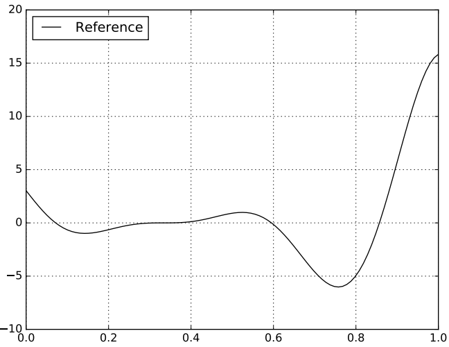

### Limits of models in computer experimentation

Simulations are costly

- A single evaluation can be computationally expensive.
- The gradient is not always available, and if missing, gradient approximation is required. 

So, optimization is costly:

- Minimizing $f$ w.r.t. $x$ by browsing the design
  parameter space, even intelligently, requires at least dozens or hundreds of
  evaluations of $f$.

So, uncertainty quantification is costly:

- When the input $x$ is uncertain,
  the output $y:=f\left(x;u\right)$ is also uncertain.
  Sampling $f$ over $\mathcal{X}\ni x$ to quantify the output uncertainty
  (e.g., mean, the standard deviation, the probability of exceeding a threshold, quantile, ...) 
  requires at least hundreds or thousands of evaluations of $f$ over the uncertain variable space.

So, visualization is costly:

- Visualizing the behavior of $f$ w.r.t. $x$ requires
  at least hundreds or thousands of evaluations of $f$ over the design
  parameter space.

!!! question
    
    How to provide a cheap but accurate approximation of $f$?

### From single output to multiple output

For the sake of clarity,
we consider a model $f$ with a scalar output $y$.

The methodological and computational tools presented in this course 
can be extended to the multiple output case.

A classical approach consists of reducing the output dimension:

1. Decompose the multiple output on an orthogonal basis,
   e.g. principal component analysis (PCA): 
   $f(x)=\sum_{i=1}^{\text{dim}(y)}\alpha_i(x)\varphi_i$ with $\varphi_i\in\mathcal{Y}$.
2. Keep the more significant modes of the basis: $f_{\text{PCA}}(x)=\sum_{i=1}^{p\ll\text{dim}(y)}\alpha_i(x)\varphi_i$.
3. For each significant mode, create a surrogate model $\hat{\alpha}_i$ of $\alpha_i$ (see how in the following sections).
4. Provide a cheap but accurate approximation of $f$ by combining the
   previous approximations: $\hat{f}_{\text{PCA}}(x)=\sum_{i=1}^{p}\hat{\alpha}_i(x)\varphi_i$.

### Approximating the simulator 

We want to **build an efficient emulator** $\hat{f}$ for the model $f$.

#### Requirements

- Accuracy: $\text{Error}(f,\hat{f})\leq \varepsilon$
- Velocity: $\text{EvaluationTime}(\hat{f})\ll\text{EvaluationTime}(f)$

#### Solution

Use a surrogate model as emulator $\hat{f}$,
based on statistical and machine learning techniques.

A surrogate model is a regression or interpolation function

$$\hat{y}\equiv\hat{f}_{\hat{\alpha}}\left(x\right)$$

- defined over the input parameter space $\mathcal{X}$,
- depending on hyperparameters $\hat{\alpha}\in\mathcal{A}$, 
- parametrized by learning a training dataset.

Training dataset:

1. Create a design of experiments (DOE)}: $x^{(1)},\ldots,y^{(n)}$.
2. Evaluate the simulator $f$: $y^{(1)},\ldots,y^{(N)}$ where $y^{(i)}=f(x^{(i)})$.
3. Create the learning dataset: $\mathcal{L}_N=\left\{(x^{(1)},y^{(1)}),\ldots,(x^{(N)},y^{(N)})\right\}$

The learning stage consists of searching the hyperparameters $\hat{\alpha}$ 
minimizing a learning error over $\mathcal{A}$, 
e.g. the mean squared error $\text{MSE}(\mathcal{L}_{N})=N^{-1}\sum_{i=1}^N\left(y^{(i)}-\hat{f}_\hat{\alpha}\left(x^{(i)}\right)\right)^2$.

!!! example "Toy model - Learning and test samples"

    10 learning samples and 3 test samples:
    
    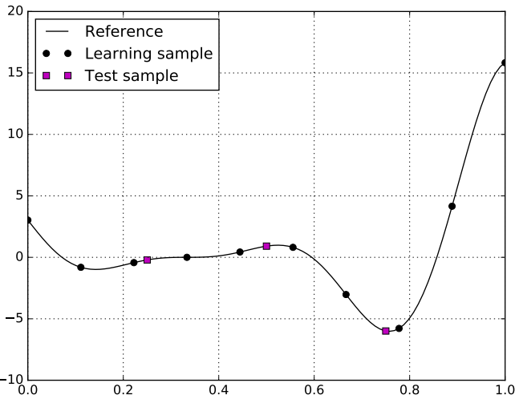

#### Quality of a surrogate model

##### Learning error

Have we learned the learning set well?

$$\text{MSE}(\mathcal{L}_{N})$$

##### Generalization error

How far is $\hat{f}$ from $f$? Less than $\varepsilon$?

$$\|f-\hat{f}_\alpha\|_2=\int_{\mathcal{X}}(f(x)-\hat{f}_{\hat{\theta}}(x))^2dx$$

##### Test error

Have we learned the model behavior well? 
When we have an additional input-output dataset $\mathcal{T}_{N}$, called test set:

$$\text{MSE}(\mathcal{T}_{N})$$

!!! warning

    When the total number of evaluations $N+N_t$ is very limited,
    learning from $N$ samples and testing on $N_t$ samples rather than learning
    from all $N+N_t$ samples can drastically reduce the quality of the surrogate model.

!!! example "Toy model - Learning and test errors"
    
    Toy model where the surrogate model is a linear regression. 
    Errors (learning, test, generalization)=(5.1, 5.2, 4.5).
    
    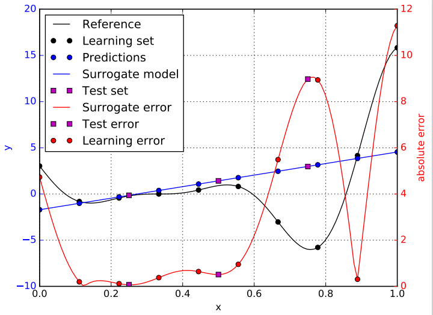

##### Cross-validation (CV) error

Have we learned the model behavior well?

We split the learning input-output set $\mathcal{L}_N$ into $K\in\{1,\ldots,N\}$ folds:

$$\mathcal{L}_N=\mathcal{F}_{N,1}\bigcup\mathcal{F}_{N,2}\bigcup\mathcal{F}_{N,K}.$$

Then, for any $k\in\{1,\ldots,K\}$, 

1. we build a new surrogate model by learning all $\mathcal{L}_N$ but $\mathcal{F}_{N,k}$,
2. we measure its accuracy on $\mathcal{F}_{N,k}$.

Finally, the cross-validation error averages these $K$ accuracies:

$$K^{-1}\sum_{k=1}^k\text{MSE}(\mathcal{F}_{N,k})$$

##### Leave-one-out (LOO) error

Have we learned the model behavior well?

The LOO error is a specific case of the CV error with $K=N$ folds.
In this case, a fold is reduced to a single sample $\mathcal{F}_{N,k}=(x^{(k)},y^{(k)})$.

!!! example "Toy model - Learning and test errors"
    
    Toy model where the surrogate model is a linear regression.
    Leave-one-out error = -0.689.
    
    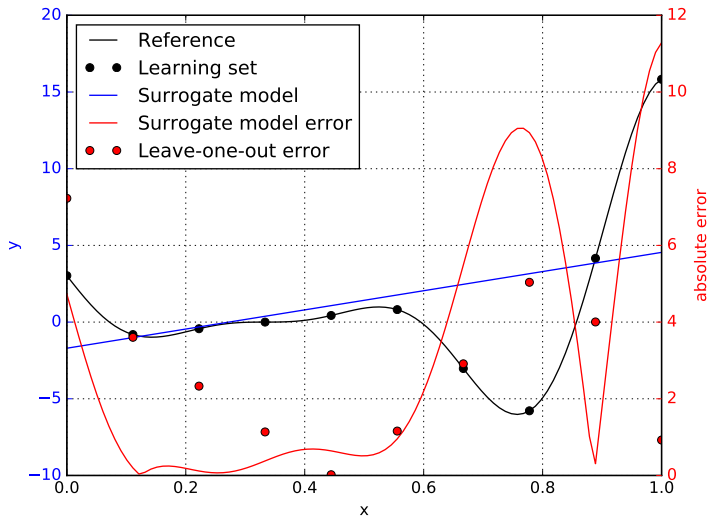

##### Q2 score

$$Q^2(\mathcal{T}_{N_\text{t}})=1-\frac{\text{MSE}(\mathcal{T}_{N_\text{t}};\hat{f}_\theta)}{\text{MSE}(\mathcal{T}_{N_\text{t}};m)}$$

where $m$ is a function returning the constant $N^{-1}\sum_{i=1}^Ny^{(i)}$ with $y^{(1)},\ldots,y^{(N)}$ the learning output samples.

How much better than the learning output mean?

- $<0$: performance poorer than the learning output mean,
- $=0$: performance similar to the learning output mean,
- $=1$: great performance (test error is 0).

In practice, we hope that

- $Q^2\in[0,1]$
- $Q^2>q_{\text{thresh}}^2$ for some $q_{\text{thresh}}\in[0,1]$, e.g. $q_{\text{thresh}}=0.9$

!!! example "Toy model - Learning and test errors"
    
    Toy model where the surrogate model is a linear regression.
    $Q^2$ (learning, test, generalization)=(0.132, -1.945, 0.032).
    
    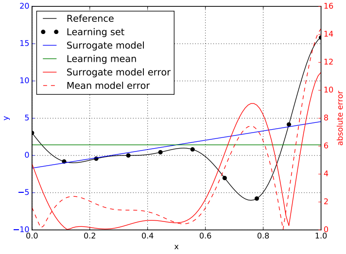

## Different surrogate models 

### Linear regressors
    
Expression:

$$\hat{f}_\alpha(x)=\alpha_0+\sum_{i=1}^d\alpha_ix_i$$

with $\alpha\in\mathbb{R}^p$ and $p=1+d$.

!!! note "Learning"

    $$\hat{\alpha}=\text{argmin}_{\alpha\in\mathcal{A}}\text{MSE}(\mathcal{L}_N;\hat{f}_\alpha)$$

!!! note "Optimum"

    $$\hat{\alpha}=\left(\mathbf{X}^T\mathbf{X}\right)^{-1}\mathbf{X}^T\mathbf{Y}$$

    where $\mathbf{X}_{i,1}=1$, $\mathbf{X}_{i,j+1}=x_j^{(i)}$ and $\mathbf{Y}_{i,1}=y^{(i)}$, $x_j^{(i)}$ (resp. $y^{(i)}$)
    being the $i^{\text{th}}$ learning value of the input $x_j$ (resp. output $y$),
    and $\mathbf{1}_N$ is the $N$-length unit vector.

Pros:

- The training is easy as it is based on fundamentals of linear algebra,
- The explainability is easy: if $\alpha_i>0$ (resp. $<0$), the surrogate model increases (resp. decreases) monotically with $x_i$.

Cons:

- There is a strong hypothesis: the model $f$ is linear without any interaction.

!!! example "Toy model - Linear model"
    
    

### Radial basis function (RBF) regressors

Expression:

$$\hat{f}_{\alpha}(x)=\alpha_0+\sum_{i=1}^N\alpha_i\kappa_{\ell}\left(x,x^{(i)}\right)$$

with $\alpha\in\mathbb{R}^p$ and $p=1+N$.

$x\mapsto\kappa_{\ell}(x,x^{(i)})$ is a radial basis function with:
 
- user-defined length scale hyperparameter $\ell$,
- position hyperparameter $x^{(i)}$.

Here is an example of radial basis function:

$$\kappa_{\ell}(x,x')=\exp\left(-\ell^{-2}\|x-x'\|_2^2\right)$$

!!! note "Learning"

    $$\hat{\alpha}=\text{argmin}_{\alpha\in\mathcal{A}}\text{MSE}(\mathcal{L}_N;\hat{f}_\alpha)$$

!!! note "Optimum"

    $$\hat{\alpha}=\left(\mathbf{K}^T\mathbf{K}\right)^{-1}\mathbf{K}^T\mathbf{Y}$$

    where
    $\mathbf{K}_{\ell,i,j+1}=\kappa_{\ell}\left(x^{(i)}-x^{(j)}\right)$ and $\mathbf{Y}^{(i)}=y^{(i)}$.

Pros:

- The training is easy as it is based on fundamentals of linear algebra,
- The explainability is medium: 
  weighted sum of learned outputs with weight $w_i(x)$ all the closer to zero than $x$ is far from $x^{(i)}$.

Cons:

- This structure of this model is dependent on the learning dataset size.

!!! example "Toy model - RBF model"
    
    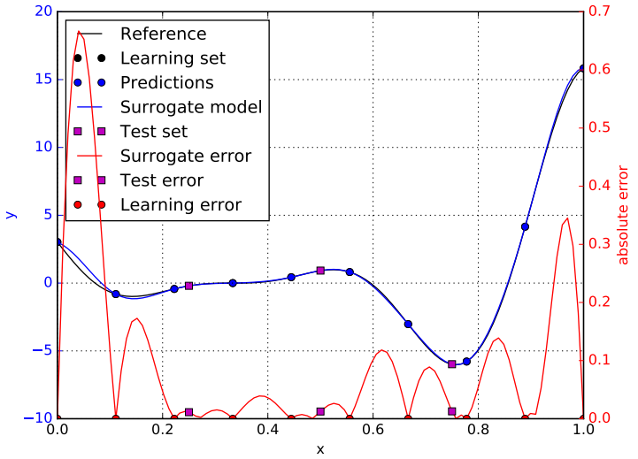

!!! example "Toy model - RBF model - Decomposition"

    Decomposition of the surrogate model into a sum of weighted of radial basis functions:
    
    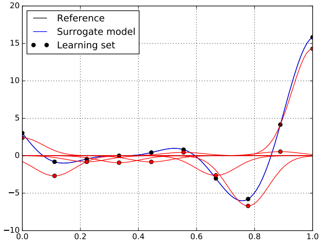

!!! example "Toy model - RBF model - Basis functions"
    
    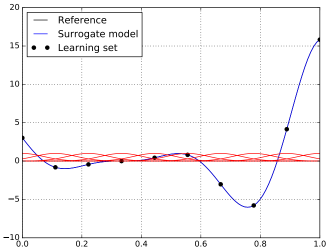

### Gaussian process (GP) regressors

GP models are also called Kriging modles.

Expression:

$$\hat{f}_\alpha(x)=\mu(x;\alpha_{\mu})+\sum_{i=1}^N\alpha_i\kappa_{\alpha_{\ell}}\left(x,x^{(i)}\right)$$

with $\alpha\in\mathbb{R}^p$ and $p=p_{\mu}+p_{\ell}$.

Estimator of the local prediction error

$$s_\alpha(x)=\sqrt{\sigma^2-k_{\ell}(x)^TK_{\ell}^{-1}k_{\ell}(x)}$$

Notations:

- $\kappa_{\ell}\left(x,x'\right)$ is stationary kernel function, 
  a.k.a. correlation function, 
  depending on the distance $\|x-x'\|_2$
- $K_{\ell}=\left(\kappa_{\ell}\left(x^{(i)},x^{(j)}\right)\right)_{1\leq
  i,j\leq N}$ is the learning correlation matrix,
- $k_{\ell}(x)=\left(\kappa_{\ell}\left(x,x^{(i)}\right)\right)_{1\leq
  i \leq N}^T$ is the correlation column vector at $x$ w.r.t. learning design of
  experiments
- $\sigma$ is the noise level.

$$\hat{f}_\alpha(x)=\mu(x;\alpha_{\mu})+\sum_{i=1}^N\alpha_i\kappa_{\alpha_{\ell}}\left(x,x^{(i)}\right)$$

!!! note "Learning"
  
    $$\hat{\alpha}=\text{argmin}_{\alpha\in\mathcal{A}}\text{MSE}(\mathcal{L}_N;\hat{f}_\alpha)$$

    - Given $\hat{\alpha}_{\ell}$, 
      the optimum $\hat{\alpha}_{\mu}$ has a closed-form expression:
      $\hat{\alpha}_{\mu}=\left(\mathbf{K}_{\ell}^T\mathbf{K}_{\ell}\right)^{-1}\mathbf{K}_{\ell}\mathbf{Y}$
      where
      $\mathbf{K}_{i,1}=1$, $\mathbf{K}_{i,j+1}=\kappa_{\ell}\left(x^{(i)},x^{(j)}\right)$
      and $\mathbf{Y}_{i}=y^{(i)}$.
    - Then, $\alpha_{\ell}$ is obtained by numerical non-linear optimization for a fixed value $\alpha_{\mu}$.
    - Then, we iterate.

Advantages:

- The training is medium, 
  as it combines fundamentals of linear algebra and 
  numerical optimization for length scale $\alpha_{\ell}$ 
  (sensitive to small learning sample size $N$).
- The surrogate model provides a local error measure $s_\alpha$.
- The explainability is medium as the surrogate model is the weighted sum of
  learned outputs with weight $w_i(x)$ tending to zero when $\|x-x^{(i)}\|$ tends to infinity.
- Structure: size - $p$ increases no more than linearly
  with $d$ (commonly, $\mu(x,\alpha_{\mu})=\alpha_{\mu,0}$ or
  $\alpha_{\mu,0}+\sum_{i=1}^d\alpha_{\mu,i}x_i$).
- Uncertainty as we model $f$ as an instance of a random process; useful for reliability, active learning design, efficient global optimization, ...

Drawbacks:

- The hypothesis is strong: $f$ is an instance of a Gaussian process.

!!! example "Toy model - GP model"
    
    Matern(5/2) kernel and $\mu(x;\alpha_0):=\alpha_0$.
    The blue envelope represents the 95% confidence interval of the surrogate model:

    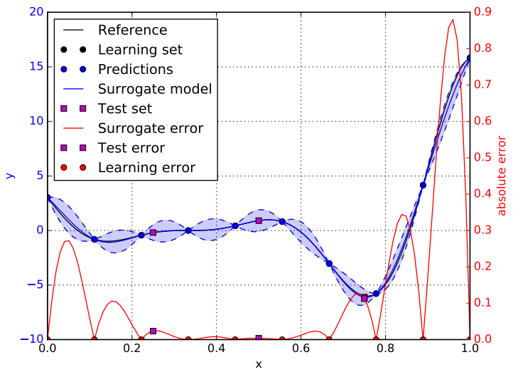

!!! example "Toy model - GP model - Decomposition"

    Decomposition of the surrogate model into a sum of weighted of radial basis functions:
    
    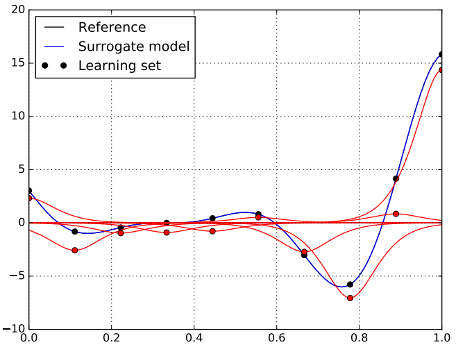

!!! example "Toy model - GP model - Basis functions"
    
    

### Polynomial chaos expansion (PCE)

Expression:

$$\hat{f}_\alpha(x)=\alpha_0+\sum_{i=1}^{p-1}\alpha_i\Psi_i(x)$$

with $\alpha\in\mathbb{R}^p$ and $\Psi_i(x)=\prod_{j=1}^d\Psi_{\tau_j(i),j}(x_j)$ where:

- $\left(\Psi_{i,j}\right)_{i\geq 1}$ is an orthonormal polynomial basis,
  *i.e.* $\mathbb{E}\left[\Psi_{i,j}(X_j)\Psi_{i',j}(X_j)\right]=\delta_{ii'}$,
- $\tau=\left(\tau_1,\ldots,\tau_d\right):\{i,\ldots,p-1\}\mapsto \mathbb{N}^d$ is an enumerating function.

- PCE are stochastic models whose inputs are random variables $\mathbf{X}$ 
  and are often used to deal with uncertainty quantification problems.

When the problem is deterministic, 
we can still use PCE 
under the assumptions that the random variables $X_1,X_2,\ldots,X_d$ are independent uniform random variables. 
Then, $\left(\Psi_{i,j}\right)_{i\geq 1}$ is the Hermite basis:

$$H_n(x)=(-1)^ne^{x^2/2}\frac{\mathrm{d}^n}{\mathrm{d}x^n}e^{-x^2/2}.$$

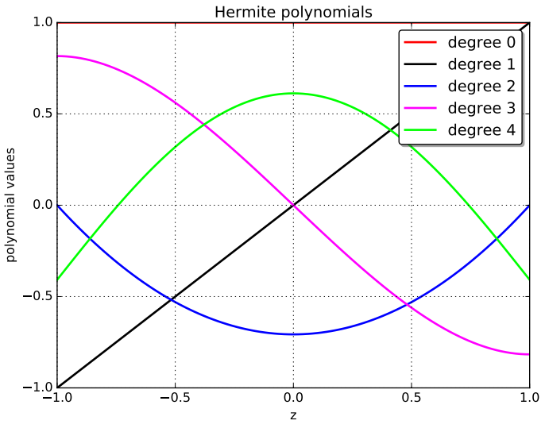

#### Learning

Classical methods dedicated to the learning of a PCE surrogate model.

!!! note "Learning by least square regression"

    $$\hat{\alpha}=\text{argmin}_{\alpha\in\mathcal{A}}\text{MSE}(\mathcal{L}_N;\hat{f}_\alpha)$$

!!! note "optimum"

    $$\hat{\alpha}=\left(\mathbf{\Psi}^T\mathbf{\Psi}\right)^{-1}\mathbf{\Psi}^T\mathbf{Y}$$
    
    where $\mathbf{\Psi}_{i,1}=1$, $\mathbf{\Psi}_{i,j+1}=\Psi_{j}(\mathbf{x}^{(i)})$ and $\mathbf{Y}_{i}=y^{(i)}$.

!!! note "Learning by sparse least square regression"

    Useful when $N<p$

    $$\hat{\alpha}=\text{argmin}_{\alpha\in\mathcal{A}}\text{MSE}(\mathcal{L}_N;\hat{f}_\alpha)+\lambda\times\text{penalty}(\alpha)$$

!!! note "Learning by quadrature"

    By orthonormality, we have that $\forall i\geq 1$, 
    $\alpha_i=\mathbb{E}\left[\left(f(\mathbf{X})-\alpha_0\right)\Psi_i(\mathbf{X})\right]$
    and $\alpha_0=\mathbb{E}[f(\mathbf{X})]$. 

    Then,
    $\left(\hat{\alpha}_i\right)_{i\geq 0}$ are obtained by quadrature techniques.

$$\hat{f}_\alpha(x)=\alpha_0+\sum_{i=1}^{p-1}\alpha_i\Psi_i(x)=\alpha_0+\sum_{i=1}^{p-1}\alpha_i\prod_{j=1}^d\Psi_{\tau_j(i),j}(x_j)$$

#### Enumerating strategy  

The choice of the function $\tau=(\tau_1,\ldots,\tau_d)$ is an enumerating strategy 
and $\tau_j(i)$ is the degree of $\Psi_{\tau_j(i),j}$. 

#### PCE degree

A PCE is defined by its degree, $P\in\mathbb{N}_+$.

$\forall i\in\{1,\ldots,p-1\}$, $\text{degree}\left(\Psi_{i}\right)=\sum_{j=1}^{d}\tau_j(i)\leq P$.

Linear enumerating strategy with $d=2$:

$$\{\emptyset\},$$

$$\{\Psi_{1,1}\},\{\Psi_{1,2}\},\{\Psi_{2,1}\},$$

$$\{\Psi_{1,1}\Psi_{1,1}\},\{\Psi_{2,2}\},\{\Psi_{3,1}\},\{\Psi_{2,1}\Psi_{1,1}\},\{\Psi_{1,1}\Psi_{2,1}\}, \{\Psi_{3,2}\}, \ldots$$

$$\Rightarrow p=\frac{(P+d)!}{P!d!} \text{ terms}$$

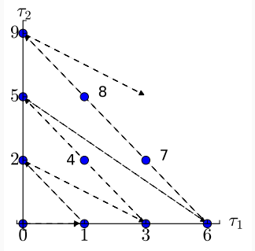

Pros:

- The training is medium, as it relies on fundamentals of linear algebra or quadrature
  but may require advanced techniques when the number of learning samples is too small.
- The model only requires that $f$ has a finite variance, *i.e* $\mathbb{E}[f(\mathbf{X})^2]<\infty$.
- The PCE can provide analytical expressions for mean, variance and Sobol' indices
- The explainability is not so easy as a PCE is polynomial regressor with many interactions between input parameters.

Cons:

- Structure: the number of parameters to be estimated $p$ increases exponentially with $d$.
- When your software library does not provide default settings,
  you have to chose training, truncation and enumerating strategies, as well as PCE degree,
  which can be a bit complicated.

!!! example "PCE"

    Polynomial chaos expansion model with a degree equal to 5.
    
    

### Comparison

|               | Linear | RBF      | GPR         | PCE      |
|---------------|--------|----------|-------------|----------|
| Configuration | -      | Gaussian | Matern(5/2) | degree=5 |
| # parameters  | 2      | 11       | 2           | 6        |
| $Q^2$ score   | 0.032  | 0.998    | 0.995       | 0.897    |
| RMSE          | 4.49   | 0.17     | 0.33        | 1.47     |
| Mean AE       | 3.02   | 0.1      | 0.22        | 1.13     |
| Median AE     | 1.08   | 0.04     | 0.10        | 0.85     |
| std           | 4.41   | 0.17     | 0.32        | 1.45     |
| Mean          | -0.88  | -0.06    | -0.09       | 0.22     |
| Minimum       | -9.05  | -0.67    | -0.84       | -2.60    |
| 1st quartile  | -2.54  | -0.08    | -0.17       | -0.77    |
| Median        | -0.52  | -0.01    | -0.01       | 0.22     |
| 3rd quartile  | -0.04  | 0.01     | 0.02        | 0.95     |
| Maximum       | 11.29  | 0.17     | 0.85        | 3.75     |

Be careful: configurations are not optimized!

## Towards the best surrogate model

Different families of surrogate models: linear regression, radial basis
function, Gaussian process regression, polynomial chaos expansion, ...

1. We train surrogate models of different architectures (*e.g*, covariance kernel) taken from different families (e.g., GP models),
   by minimizing a learning error.
2. Among each family, 
   we select the surrogate model whose architecture minimizes a test error or a cross-validation error.
3. Over the different families,
   we select the surrogate model minimizing a test error or a cross-validation error.
