# 3. Uncertainty characterization

## Probability distributions

### Discrete probability distribution

#### Bernouilli

- $\mathcal{X}=\{0,1\}$ or $\mathcal{X}=\{\text{failure},\text{success}\}$
- $\mathbb{P}[X=1]=p$ and $\mathbb{P}[X=0]=1-p$
- $\mathbb{E}[X]=p$ and $\mathbb{V}[X]=p(1-p)$

??? example

    The result of a single round of coin tossing:

    

#### Binomial

- $\mathcal{X}=\{0, 1,2,\ldots,N\}$
- $\mathbb{P}[X=x]=C_N^xp^x(1-p)^{N-x}$
- $\mathbb{E}[X]=Np$ and $\mathbb{V}[X]=Np(1-p)$

??? example 

    The number of heads after $N$ independent rounds of coin tossing:

    

    
    ..................
    

#### Uniform

- $\mathcal{X}=\{a,a+1,\ldots,b-1,b\}$ with $a,b\in\mathbb{N}$ and $a\leq b$
- $\forall x\in\mathcal{X}$, $\mathbb{P}(X=x)=\frac{1}{b-a+1}$
- $\forall x\in\mathcal{X}$, $\mathbb{P}(X\leq x)=\frac{x-a+1}{b-a+1}$
- $\mathbb{E}[X]=\frac{a+b}{2}$ and $\mathbb{V}[X]=\frac{(b-a+1)^2-1}{12}$

??? example

    The result of a single die roll:

    

#### Multinomial

- $\mathcal{X}=\mathcal{X}_1\times \ldots \times \mathcal{X}_N$ with $\mathcal{X}_i=\{a,a+1,\ldots,b-1,b\}$
- $\mathbb{P}[X_a=n_a,X_{a+1}=n_{a+1},\ldots,X_{b-1}=n_{b-1},X_b=n_b]=\frac{N!}{n_a!\ldots n_b!}p_a^{n_a}\ldots p_b^{n_b}$
- $\forall k \in\{a,a+1,\ldots,b-1,b\}$, $\mathbb{E}[X_k]=Np_k$ and $\mathbb{V}[X_k]=Np_k(1-p_k)$

??? example 

    The number of 1, 2, ..., 6 after $N$ independent rounds of dice rolls:

    

    
    ..................
    

#### Poisson

- $\mathcal{X}=\mathbb{N}$
- $\mathbb{P}[X=k]=\frac{\lambda^k}{k!}e^{-\lambda}$ with $\lambda\in\mathbb{N}^*$
- $\mathbb{E}[X]=\mathbb{V}[X]=\lambda$
- Meaning: Number of occurrences of an event during a time interval knowing the mean occurrence rate.

??? example

    The number of decay events per second from a radioactive source:

    

### Continuous probability distributions

#### Uniform

- $\mathcal{X}=[a,b]$
- $f_X(x)=\frac{1}{b-a}$      
- $\mathbb{P}[X\leq x]=\frac{x-a}{b-a}$
- $\mathbb{E}[X]=\frac{a+b}{2}$ and $\mathbb{V}[X]=\frac{(b-a)^2}{12}$

Uniform distribution over $[a,b]$ with minimum $a$ and maximum $b$:

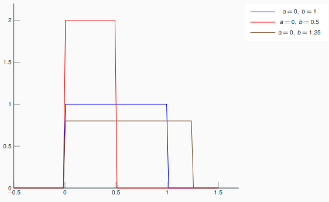

??? example

    - Inverse transform sampling method to sample a random variable based on the inverse of the cumulative distribution function.
    - Modeling a random phenomenon for which there is little information except minimum and maximum values (bad habit because it implies an equiprobability over the associated interval), 
    - ...

!!! tip "Inverse transform sampling"
 
    If $U$ has an uniform distribution on $[0,1]$ and if $X$ as a cumulative distribution function $F_X$, then the random variable $F_X^{-1}(U)$ has the same distribution as $U$. Thus, if $F_X^{-1}$ is easy to obtain and evaluate, the following sampling method works:

    - Generate $u$, an instance of the standard uniform random variable $U$.
    - Find the inverse distribution $F_X^{-1}$.
    - Compute $x=F_X^{-1}(u)$.

#### Triangular

- $\mathcal{X}=[a,b]$
- $f_X(x)=\frac{2(x-a)}{(b-a)(c-a)}\mathrm{1}_{a\leq x<c}+\frac{2}{b-a}\mathrm{1}_{x=c}+\frac{2(b-x)}{(b-a)(c-a)}\mathrm{1}_{c< x\leq b}$      
- $\mathbb{P}[X\leq x]=\frac{(x-a)^2}{(b-a)(c-a)}\mathrm{1}_{a< x<=c}+\left(1-\frac{(b-x)^2}{(b-a)(c-a)}\right)\mathrm{1}_{c< x\leq b}$      
- $\mathbb{E}[X]=\frac{a+b+c}{3}$ and $\mathbb{V}[X]=\frac{a^2+b^2+c^2-ab-ac-bc}{18}$

Triangular distribution over $[a,b]$ with interval $[a,b]$ and mode $m$:

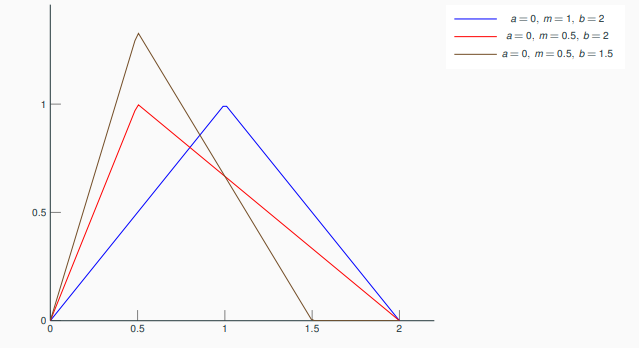

??? example

    Subjective description of a population for which there is only limited sample data but knowledge of minimum, maximum and mode.

#### Normal

- $\mathcal{X}=\mathbb{R}$
- $f_X(x)=\frac{1}{\sqrt{2\pi}\sigma}\exp\left(-\frac{(x-\mu)^2}{2\sigma^2}\right)$      
- $\mathbb{P}[X\leq x]=\frac{(x-a)^2}{(b-a)(c-a)}\mathrm{1}_{a< x<=c}+\left(1-\frac{(b-x)^2}{(b-a)(c-a)}\right)\mathrm{1}_{c< x\leq b}$      
- $\mathbb{E}[X]=\mu$ and $\mathbb{V}[X]=\sigma^2$

Normal distribution over $\mathbb{R}$ with mean $\mu$ and standard deviation $\sigma$

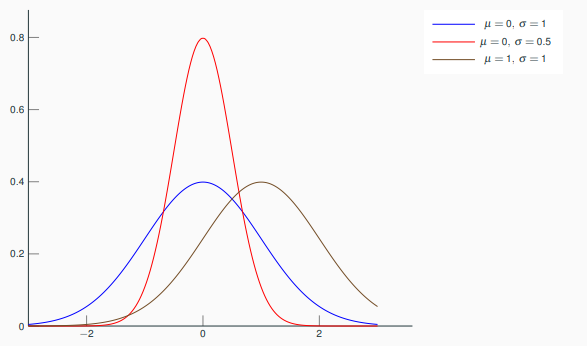

??? example

    Human size among a human population with given age and sex, beak size in a bird population, growth curve on health books, measurement error made by a laboratory technician, cannon fire, ...

    Extract from the French child health record. Note that in this new edition, the weight is no longer normally distributed:

    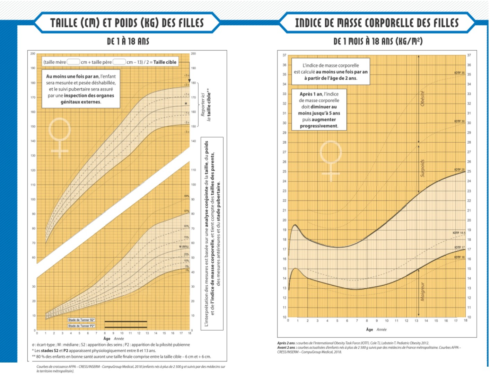
    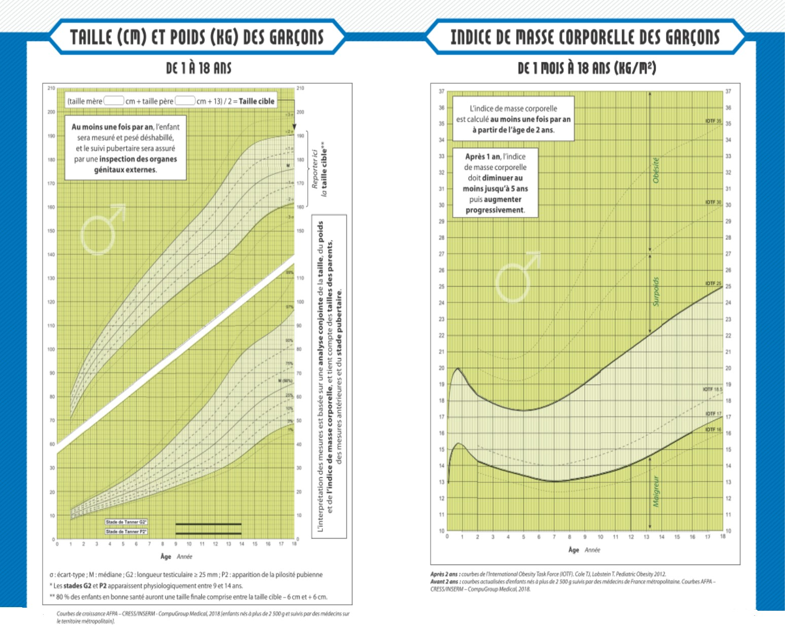

Extract from the French child health record. Note that in this new edition, the weight is no longer normally distributed.

#### Chi-squared

- $\mathcal{X}=\mathbb{R}$
- $f_X(x)=\frac{1}{2^{k/2}\Gamma(k/2)}x^{k/2-1}e^{-x/2}$      
- $\mathbb{P}[X\leq x]=\frac{1}{\Gamma(k/2)}\gamma(\frac{k}{2},\frac{x}{2})$
- $\mathbb{E}[X]=k$ and $\mathbb{V}[X]=2k$
- If $Z_1,\ldots,Z_k\sim_{i.i.d.}\mathcal{N}(0,1)$, then $\sum_{i=1}^kZ_i^2\sim\mathcal{X}^2_k$

Chi-squared distribution over $\mathbb{R}_+$ with $k$ degrees of freedom
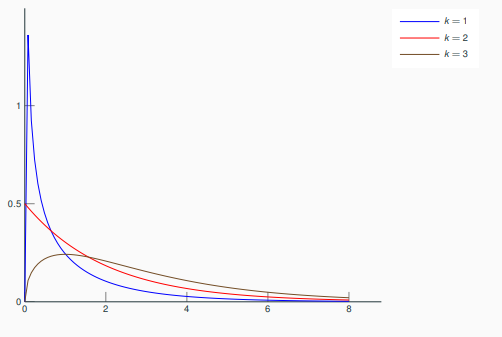

??? example

    - Relationships between categorical variables,
    - Statistical tests,
    - Confidence interval estimations in presence of normal random variables,
    - ...

#### Lognormal
 
- $\mathcal{X}=\mathbb{R}_+$
- $f_X(x)=\frac{1}{x\sigma\sqrt{2\pi}}\exp\left(-\frac{(\ln(x)-\mu)^2}{2\sigma^2}\right)$
- $\mathbb{P}[X\leq x]=\frac{1}{2}+\frac{1}{2}\text{erf}\left(\frac{\ln(x)-\mu}{\sqrt{2}\sigma}\right)$
- $\mathbb{E}[X]=\exp\left(\mu+\frac{\sigma^2}{2}\right)$ and $\mathbb{V}[X]=\left(\exp(\sigma^2)-1\right)\exp(2\mu+\sigma^2)$
- If $X\sim\mathcal{N}(\mu,\sigma^2)$, then $\exp(X)\sim\log-\mathcal{N}(\mu,\sigma^2)$

LogNormal distribution over $\mathbb{R}_+$ with $\mu$ and $\sigma$ the mean and standard deviation of the logarithm of a random variable so distributed

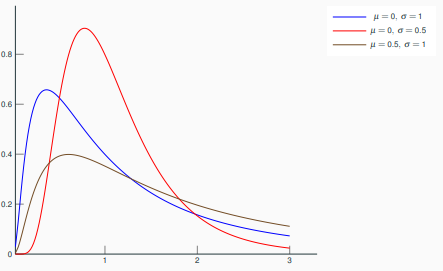

??? example

    - Time to repair a maintainable system in reliability analysis,
    - Particle size in polymer chemistry,
    - Blood pressure,
    - Length of comments posted in Internet discussions,
    - Annual maximum one-day rainfalls of river discharges,
    - ... 

    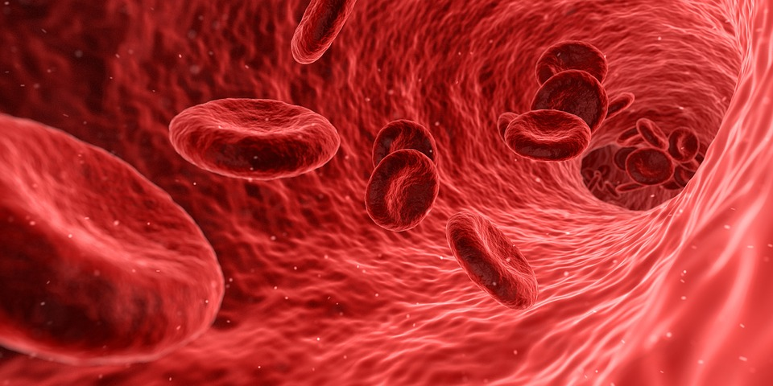

#### Exponential

Exponential distribution over $\mathbb{R}_+$ with rate $\lambda$ and mean $1/\lambda$

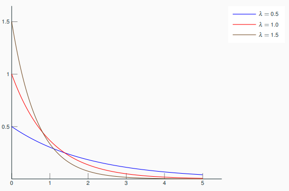

??? example

    - Service time of agents in a system,
    - Constant hazard rate portion of the bathtub curve used in reliability theory,
    - Amount of time until a battery falls,
    - ...

    More generally, lengths of the inter-arrival times in a homogeneous Poisson process.

    

#### Gumbel

Gumbel distribution over $\mathbb{R}$ with position parameter $\lambda$ and scale parameter $\beta$

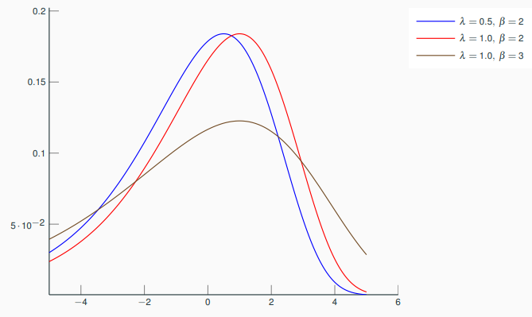

??? example

    - Distribution of the maximum (or the minimum) of a number of samples of various distributions,
    - Prediction of earthquake, 
    - Prediction of the flood level of a river based on a 10-year flow survey,
    - ...

    

#### Weibull 

- $\mathcal{X}=\mathbb{R}_+$
- $f_X(x)=\frac{k}{\lambda}\left(\frac{x}{\lambda}\right)^{k-1}e^{-(x/\lambda)^k}$
- $\mathbb{P}[X\leq x]=1 - e^{-(x/\lambda)^k}$
- $\mathbb{E}[X]=\lambda\Gamma(1+1/k)$ and $\mathbb{V}[X]=\lambda^2\left(\Gamma(1+2/k)-\Gamma^2(1+1/k)\right)$

Weibull distribution over $\mathbb{R}_+$ with scale parameter $\lambda$ and shape parameter $k$

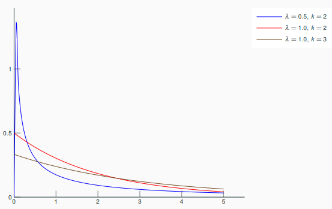

??? example

    - Overvoltage occurring in an electrical system,
    - Wind speed distribution,
    - Fading channel in wireless communications,
    - ...

    

#### Beta

Beta distribution over $[0,1]$ with shape parameters $\alpha$ (number of successes) and $\beta$ (number of failures)

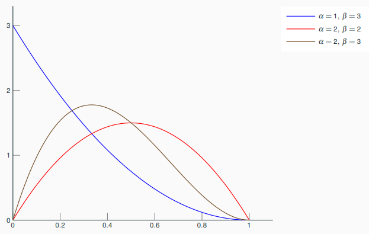

!!! example "Applications"

    - Outcomes expressed as percentages or proportions,
    - The random variable representing the probability of an event,
    - ...

    

## Uncertainty characterization without data

Without any observation of the random variable $X$, 
whether it is direct or indirect,
expert advices are required to associate a probability distribution to $X$.

??? example "Examples of expert opinion"

    - $X$ is either positive, negative, continuous or discrete,
    - $X$ belongs to $[a,b]$,
    - $m$ is the realization of $X$ most likely to occur
    - $\mu$ is the mean value of $X$ and $\sigma$ its standard deviation

Elicitation is the art of converting expert opinion into a law of probability.
Given a set of probability distribution and an expert opinion, 
the goal is to maximize the statistical entropy

$$H(X)=-\int_{\mathcal{X}}p(x)\log(p(x))dx$$

when $X$ is a continuous random variable with $p$ as probability density function and 

$$H(X)=-\sum_{k=1}^K\mathbb{P}[X=x_k]\log(\mathbb{P}[X=x_k])$$

when $X$ is a discrete random variable.

Based on expert knowledge relative to the values taken by the uncertain variable $X$, 
we can apply the principle of maximum entropy and find an objective probability distribution modeling $X$.

??? question "$X$ belongs to $[a,b]$"

    Uniform distribution $\mathcal{U}([a,b])$

??? question "$X$ belongs to $[a,b]$ and $m$ is the most probable value"

    Triangular distribution $\mathcal{T}(a,b,m)$

??? question "$X$ is centered around $\mu$ with standard deviation $\sigma$"

    Normal distribution $\mathcal{N}(\mu,\sigma^2)$

??? question "$X$ is positive and centered around $\mu$"

    Exponential distribution $\mathcal{E}(\mu^{-1})$

??? question "$X$ is the probability of an event observed $N$ times with $N'$ successes"

    Beta distribution $\mathcal{B}(N',N-N')$

## Uncertainty characterization with data

Now, 
we have some realizations of the random variable $X$
and we will try to infer its probability law.

### Estimation of a probability distribution

Let $x^{(1)},\ldots,x^{(n)}$ be a series of 
$n$ independent realizations of a random variable $X$
with a probability density function $f_{\theta}(x)$
parametrized by $\theta\in\Theta$.

!!! example

    A Gaussian variable with mean $\mu$ and variance $\sigma^2$
    has the probability density function

    $$f_{\theta}(x)=\frac{1}{\sqrt{2\pi}\sigma}e^{-\frac{(x-\mu)^2}{2\sigma^2}}$$ 

    where $\theta=(\mu,\sigma)\in\mathbb{R}\times\mathbb{R}_+^*$.

#### Likelihood

The likelihood measures the possibility that 
the independent samples $x^{(1)},\ldots,x^{(n)}$ are distributed 
according to a probability distribution of density $f_{\theta}$.

The likelihood is written as
the product of the probability density function evaluated at the $n$ samples:

$$L\left(\theta;x^{(1)},\ldots,x^{(n)}\right) = \prod_{i=1}^nf_{\theta}\left(x^{(i)}\right)$$

and we often prefer to use its logarithm:

$$\log-L\left(\theta;x^{(1)},\ldots,x^{(n)}\right) = \sum_{i=1}^n \log\left(f_{\theta}\left(x^{(i)}\right)\right).$$

#### Maximizing the likelihood

Searching the parameters $\hat{\theta}$
that maximize the likelihood $L$ (or its logarithm $log-L$) over $\Theta$ 
is a common approach to select the most likely probability function among $\{f_{\theta}(x):\theta\in\Theta\}$ 
based on the observations $x^{(1)},\ldots,x^{(n)}$.

??? example "Uniform distribution"

    Let $x^{(1)},\ldots,x^{(n)}$ be a series of $n$ independent realizations of a uniform variable
    with probability density function
    
    $$f_{(a,b)}(x)=\frac{1}{b-a}\mathrm{1}_{x\in[a,b]}.$$

    The likelihood is written as

    $$L\left(a,b;x^{(1)},\ldots,x^{(n)}\right)=\frac{1}{(b-a)^n}\mathrm{1}_{x^{(1)}\in[a,b]}\ldots\mathrm{1}_{x^{(n)}\in[a,b]}$$

    and it maximized at

    $$\hat{a}=\min_{1\leq i \leq n}x^{(i)} \quad \text{ and }\quad \hat{b}=\min_{1\leq i \leq n}x^{(i)}$$

    !!! warning "The MLEs of $a$ and $b$ are biased"

        Indeed, $\mathbb{E}[\hat{a}]=\frac{n+1}{n}a=a+n^{-1}a\neq a$ and $\mathbb{E}[\hat{b}]=\frac{n+1}{n}b=b+n^{-1}b\neq b$.
        
        Here are unbiased estimators of $a$ and $b$: $\hat{a}_u=\frac{n}{n+1}\hat{a}$ and $\hat{b}_u=\frac{n}{n+1}\hat{b}$.

??? example "Normal distribution"

    Let $x^{(1)},\ldots,x^{(n)}$ be a series of $n$ independent realizations of a Gaussian variable
    with probability distribution

    $$f_{\mu,\sigma}(x)=\frac{1}{\sqrt{2\pi}\sigma}\exp\left(-\frac{\left(x-\mu\right)^2}{2\sigma^2}\right).$$

    The likelihood is written as

    $$L\left(\mu,\sigma;x^{(1)},\ldots,x^{(n)}\right)=\frac{1}{\sqrt{2\pi}^n\sigma^n}\exp\left(-\frac{\sum_{i=1}^n\left(x^{(i)}-\mu\right)^2}{2\sigma^2}\right)$$

    and its logarithm as

    $$\log-L\left(\mu,\sigma;x^{(1)},\ldots,x^{(n)}\right)=-\frac{n}{2}\log(2\pi\sigma^2) -\frac{1}{2\sigma^2}\sum_{i=1}^n\left(x^{(i)}-\mu\right)^2.$$

    It is maximized at

    $$\hat{\mu}=\frac{1}{n}\sum_{i=1}^nx^{(i)} \quad \text{ and }\quad \hat{\sigma}=\frac{1}{n}\sum_{i=1}^n\left(x^{(i)}-\hat{\mu}\right)^2$$

### Parametric vs. non-parametric estimation

Let $X$ be the random variable of interest and $x^{(1)},x^{(2)},\ldots, x^{(n)}$ be a $n$-sample where these $n$ samples are independent and identically distributed (i.i.d.). 

!!! info "Parametric fitting" 

    Given a set of probability distributions, we test if it is likely that the data $x^{(1)},x^{(2)},\ldots, x^{(n)}$ are distributed according to at least one of them, and if so, we select the probability distribution that maximizes the likelihood.

!!! info "Non-parametric fitting"

    When the data $x^{(1)},x^{(2)},\ldots, x^{(n)}$ fail to adjust well to one of the probability distributions, 
    we can estimate either the cumulative density function $F_n(x)=\frac{1}{n}\sum_{i=1}^n\mathbf{1}_{x^{(i)}\leq x}$
    or the probability density function by means of

    - an histogram $f_n(x)=\frac{1}{nh}\sum_{i=1}^n\mathbf{1}_{x^{(i)}\in I_h(x)}$ where $I_h(x)$ is the interval containing $x$,
    - a kernel-based density estimator: $f_n(x)=\frac{1}{nh}\sum_{i=1}^nK\left(\frac{x-x^{(i)}}{h}\right)$.

#### Parametric fitting

A statistical hypothesis is a hypothesis that is testable by means of observations of random variables.

A statistical hypothesis test starts from a statistical hypothesis, called *null hypothesis*, that is done about:

- either the relationship of two datasets in terms of distributions (e.g. same distribution) or statistical properties (e.g. same mean),
- or the relationship of a dataset and a reference probability law in terms of distributions (e.g. Gaussian variable).

A statistical hypothesis test of **significance level** $\alpha$

- compares this *null hypothesis* $\mathcal{H}_0$ to an *alternative hypothesis* $\mathcal{H}_1$ from observations,
- wrongly rejects $\mathcal{H}_0$ with a type 1 error $\alpha$ *defined* by the user,
- wrongly keeps $\mathcal{H}_0$ with a type 2 error $\beta(\alpha)$ *suffered by the user*.

> "If the probability of obtaining a result as extreme as the one obtained, supposing that the null hypothesis were true, is lower than a pre-specified cut-off probability (for example, 5\%), then the result is said to be statistically significant and the null hypothesis is rejected." - Wikipedia, 29.10.19

> "[The null hypothesis] is never proved or established, but is possibly disproved, in the course of experimentation. Every experiment may be said to exist only in order to give the facts a chance of disproving the null hypothesis." - Fisher, 1935.

In the case of distribution fitting, statistical hypotheses are:

- $\mathcal{H}_0$: $x^{(1)},\ldots,x^{(n)}$ are distributed according to a probability distribution with cumulative distribution function $F(x;\hat{\theta})$ with parameter estimate $\theta$.
- $\mathcal{H}_1$: $x^{(1)},\ldots,x^{(n)}$ are not distributed in this way.

In practice:

1. Compute a test statistics $S_*$ from data.
2. Reject $\mathcal{H}_0$ when $S_*$ is $>$ a reference value $s_{\alpha}$.

??? example "Kolmogorov Smirnov statistics - Speciality: around the median" 

    $$S_{\text{KS}}=\sup_{x\in\mathcal{X}}~\sqrt{n}\left|F_n(x)-F(x)\right|$$

??? example "Cramer Von Mises Smirnov statistics - Speciality: whole distribution"
    
    $$S_{\text{CM}}=\int_{-\infty}^{\infty}\left(F_n(x)-F(x)\right)^2dF(x)$$

??? example "Anderson Darling statistics - Speciality: rare events"

    $$S_{\text{AD}}=n\int_{-\infty}^{\infty}\frac{\left(F_n(x)-F(x)\right)^2}{F(x)(1-F(x))}dF(x)$$

#### Non-parametric fitting
Based on the data $x^{(1)},x^{(2)},\ldots, x^{(n)}$,
compare cumulative distribution functions:

1. select a probability distribution with unknown parameters.
2. estimate these parameters by maximum likelihood.
3. overlay and compare 
   the empirical cumulative distribution function and
   the cumulative distribution function of the selected probability distribution with the estimated parameters,

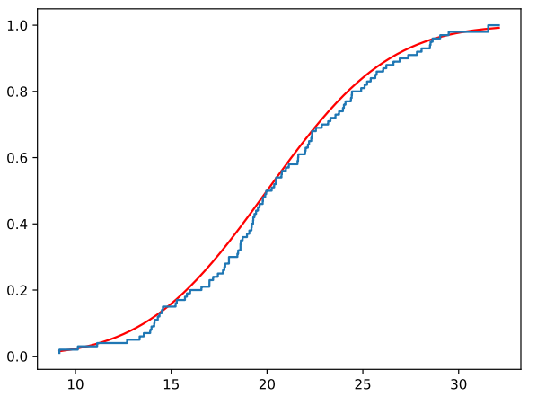

Based on the data $x^{(1)},x^{(2)},\ldots, x^{(n)}$, compare quantiles with a QQ-plot:
 
1. select a probability distribution with unknown parameters;
2. estimate these parameters by maximum likelihood,
3. compare on a graph the empirical quantiles and the quantiles of the selected probability distribution with the estimated parameters.

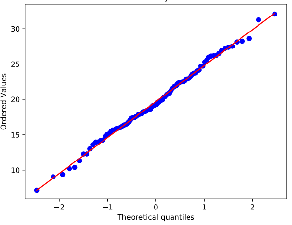

