# 4. Uncertainty propagation

## Introduction

Propagating uncertainties from inputs to outputs means sampling the model in two-step:

1. sampling the inputs to get $N$ values $x^{(1)},\ldots,x^{(N)}$,
2. evaluate the model $f$ at these input values: $f(x^{(1)}),\ldots,f(x^{(N)})$

The way to generate the input samples $x^{(1)},\ldots,x^{(N)}$ is called _design of experiments (DOE)_.

DOE techniques are not just useful for UQ.

??? Example "Statistics estimation" 

    When the probability distributions of the uncertain input variables is defined,
    the random input variables are sampled according to these distributions
    and quantities of interest (i.e. statistics related to the output of interest) can be estimated from the output samples.

??? Example "Trade-off studies"

    When the input variables are only defined from bounds,
    the input variables are sampled uniformly between bounds
    and the best output value is selected among $f(x^{(1)}),\ldots,f(x^{(N)})$.
    This is a way to approximate the model optimum over the whole input space.

??? Example "Surrogate modelling"

    The input-output dataset $\{x^{(i)},f(x^{(i)})\}_{1\leq i \leq N}$ can be used to train a surrogate model $\hat{f}$
    in order to approximate the model $f$ over the whole input space, using machine learning techniques.

For all these examples, 
we seek to create a DOE $x^{(1)},\ldots,x^{(N)}$ whose 

- coverage of the input space is the best possible,
- number of samples $N$ is constrained by the cost of a model.

The objective is to sample the input space \underline{sparingly} and methodically (``optimally''), 
in order to collect as much information as possible on the input-output model behavior with no more than $N$ samples.

The art of DOE techniques is to find a good set of input samples $x^{(1)},\ldots,x^{(N)}$.

The default technique is Monte Carlo sampling.
Unfortunately, 
the accuracy of the statistics estimators increases slowly with $N$ (in $1/\sqrt{N}$ for the expectation).

Here are three alternatives to Monte Carlo sampling:
 
- quasi Monte Carlo to get a better convergence rate of the estimator,
- importance sampling to decrease the constant of the estimator variance,
- replace the model with a surrogate model trained from $N$ samples 
  and estimate statistics by intensively sampling the surrogate model.

Lastly,
the DOE techniques rarely consider the probability distributions of the input random variables.
Instead, 
they apply to the uniform distribution over the unit hypercube,
using the inverse transform sampling technique.

??? info "Inverse transform sampling"
    
    If $U$ has a uniform distribution on $[0,1]$ and if $X$ as a cumulative distribution function $F_X$, 
    then the random variable $F_X^{-1}(U)$ has the same distribution as $U$. 
    Thus, if $F_X^{-1}$ is easy to obtain and evaluate, the following sampling method works:

    1. generate $u$, an instance of the standard uniform random variable $U$,
    2. compute $x=F_X^{-1}(u)$.

Therefore,
given random input variable $X$ with values in $\mathcal{X}\subset\mathbb{R}^d$, 
we often

1. apply a DOE technique to sample uniformly and sparingly the unit hypercube $[0,1]^d$
   and get $u^{(1)},\ldots,u^{(N)}$,
2. apply the cumulative distribution function $F_X^{-1} to $u^{(1)},\ldots,u^{(N)}$
   and get $x^{(1)},\ldots,x^{(N)}$,
3. evaluate the model $f$
   and get $f(x^{(1)}),\ldots,f(x^{(N)})$
 
## DOE for real experiments

### Full factorial DOE

??? note "Method"

    Each input parameter is placed at one of $n_{\text{levels}}$ values, 
    usually $n_{\text{levels}}=2$ levels coded as -1 and +1 which correspond to low and high levels.

    Number of points: $n=n_{\text{levels}}^d$

    !!! Example

        When $d=3$ and $n_{\text{levels}}=2$:
        ```
        -1 -1 -1
        -1 -1 +1
        -1 +1 -1
        -1 +1 +1
        +1 -1 -1
        +1 -1 +1
        +1 +1 -1
        +1 +1 +1
        ```
 
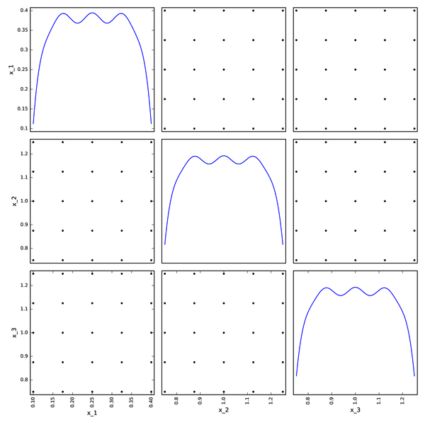

### Box-Behnken DOE
 
??? note "Method"

    Each input parameter is placed at one of three equally spaced values, 
    usually coded as -1, 0, +1.

    The placement is done as follows:

    1. Define blocks of lower dimension.
    2. For each block, apply a full factorial design with 2 levels around a central point.
    3. Add the central points.

    Number of points: $n=d*2^{d-1}+1$.

    !!! Example

        When $d=3$:
        \begin{table}
        \centering
        \begin{tabular}{rrr|rrr|rrr}
         0 &  0 &  0 &  0 &  0 &  0 & 0 &  0 &  0 \\  
        --1 & --1 &  0 & --1 &  0 & --1 & 0 & --1 & --1 \\  
        +1 & --1 &  0 & +1 &  0 & --1 & 0 & +1 & --1 \\  
        --1 & +1 &  0 & --1 &  0 & +1 & 0 & -1 & +1 \\  
        +1 & +1 &  0 & +1 &  0 & +1 & 0 & --1 & +1 \\
        \end{tabular}
        \end{table}

Box-Behnken DOE with $d=3$ and $n=13$:
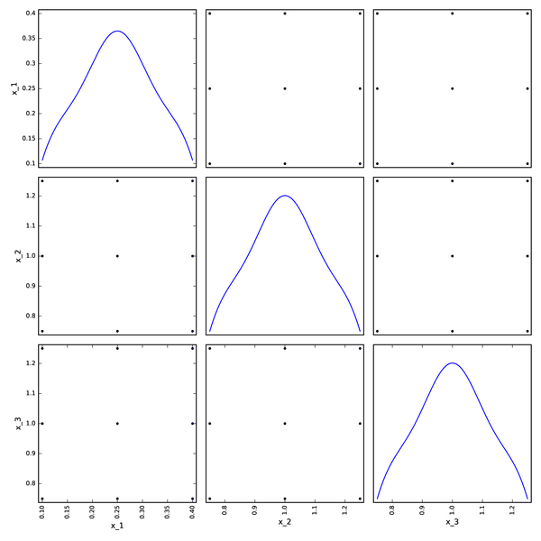

### Factorial DOE
    
??? note "Method"

    Stratified DOE generating a pattern with points:

    - only on diagonals of the parameter space
    - at specified levels,
      e.g.
      $\alpha_1,\alpha_2,\ldots,\alpha_{n_{\text{levels}}}$
      \item symmetrically with respect to the center\\
      e.g.
      $-\alpha_{n_{\text{levels}}},\ldots,-\alpha_2,-\alpha_1,0,+\alpha_1,+\alpha_2,\ldots,+\alpha_{n_{\text{levels}}}$.

Remarks:
 
- Not convenient to model influences of single input variables.
- Number of points: $1 + 2^d n_{\text{levels}}$.

Factorial DOE when $d=3$, $n_{\text{levels}}=5$ and $n=41$:
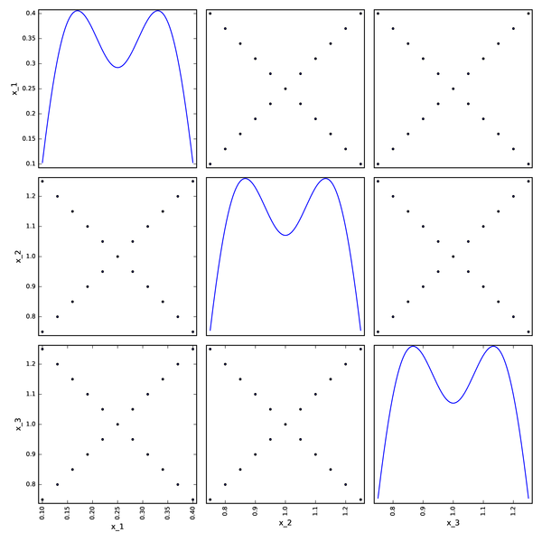

### Axial DOE

??? note "Method"

    Stratified DOE generating a pattern with points:

    - only along the axes
    - at specified levels,
      e.g.
      $\alpha_1,\alpha_2,\ldots,\alpha_{n_{\text{levels}}}$
      \item symmetrically with respect to the center\\
      e.g.
      $-\alpha_{n_{\text{levels}}},\ldots,-\alpha_2,-\alpha_1,0,+\alpha_1,+\alpha_2,\ldots,+\alpha_{n_{\text{levels}}}$.

Remarks:

- Not convenient to model interactions between variables
- Number of points: $1 + 2n_{\text{levels}}d$

Axial DOE when $d=3$, $n_{\text{levels}}=5$ and $n=31$:
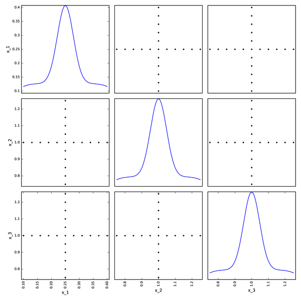

### Composite DOE

??? note "Method"

    A composite DOE is a stratified DOE combining a factorial DOE and an axial DOE.

Remarks:

- Not convenient to model interactions between variables.
- Number of points: $1 + n_{\text{levels}}(2d+2^d)$.

Composite DOE when $d=3$, $n_{\text{levels}}=5$ and $n=71$:
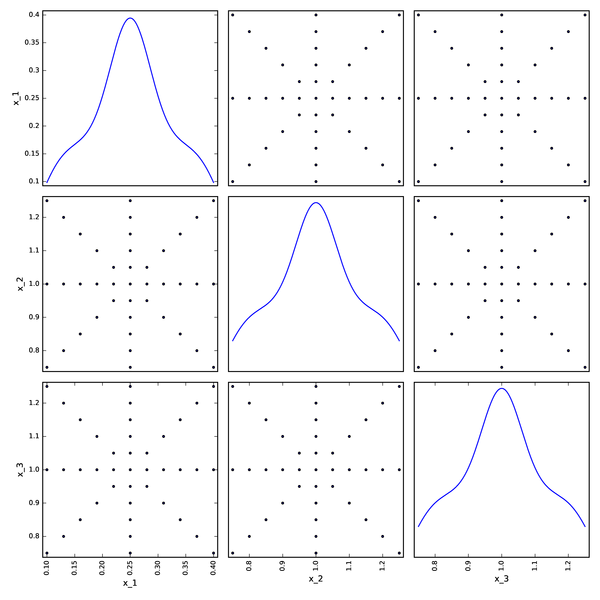

### Limitations

This DOE techniques are not the most suitable for

- numerical experiments (software output, not physical measure),
- large number of input parameters,
- large range of input variation domain,
- multiple output parameters,
- strong interactions between input parameters,
- high non-linearities in the model.

In these cases, 
we look for space-filling DOE
such as

- random sampling / Monte Carlo sampling,
- low-discrepancy sequences,
- latin Hypercube Sampling.

## Random sampling

Random uniform sampling in $[0,1]^d$.

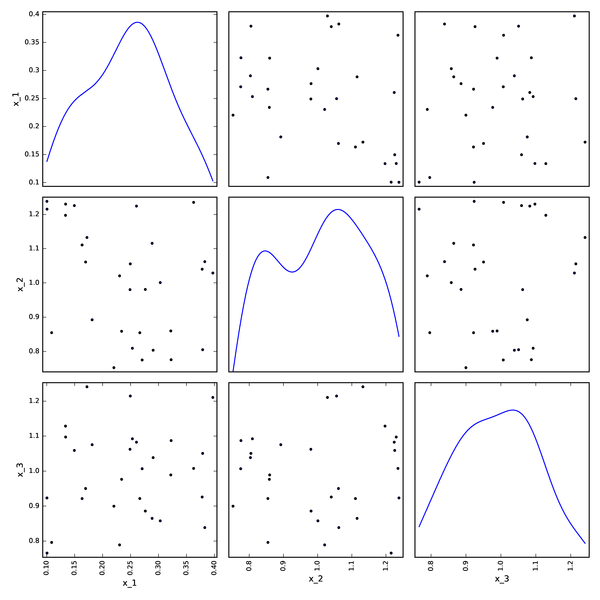

## Low-discrepancy sequences

### What is it?

Sequence:

- An enumerated collection of objects:
  $(\mathbf{x}_1,\mathbf{x}_2,\ldots)$
- Finite: $(\mathbf{x}_1,\mathbf{x}_2,\ldots,\mathbf{x}_N)$ or infinite
  $\left(\mathbf{x}_i\right)_{i\geq 1}$.
- Formally, a function defined on the natural number set $\mathbb{N}^*$
  or on the subset $\{1,2,\ldots,N\}$,  e.g. $\forall i\in\mathbb{N}^*,
  x_i=\cos(i\pi)$  or $x_{i+1}=2x_i+1$ with $x_1=0$ (which can be
  rewritten $x_i=\sum_{i=1}^N2^{i-1})$.
- Order matters.
- Repetitions are allowed.

Discrepancy: 

- A measure of deviation from the uniformity
  How much a sequence $(\mathbf{x}_1,\mathbf{x}_2,\ldots,\mathbf{x}_N)$ is far from a uniform sampling.

Low discrepancy sequence:

- A sequence $(\mathbf{x}_1,\mathbf{x}_2,\ldots,\mathbf{x}_N)$ close to an uniform  sampling.

### Convergence rate

Let's imagine we want to estimate the integral of $f$ by sampling with an error $\varepsilon$:

$$\left|\int_{[0,1]^d}f(\mathbf{x})d\mathbf{x}-
\frac{1}{N}\sum_{i=1}^Nf\left(\mathbf{x}^{(i)}\right)\right|\leq \varepsilon$$

Monte-Carlo sampling:

$$N=\mathcal{O}\left(\frac{1}{\varepsilon^2}\right)\text{, then
}\varepsilon/10\Rightarrow N\times 100$$

Low-discrepancy sequences:

$$N=\mathcal{O}\left(\frac{1}{\varepsilon}\right)\text{, then
}\varepsilon/10\Rightarrow N\times 10$$

Thus,
the convergence rate of the estimator based on low-discrepancy sequence is much better 
than the one of the estimator based on Monte Carlo sampling.
Low-discrepancy sequences are of interest when $N$ is small!

### Who's who?

Here are two sets of 100 samples in $[0,1]\times[0,1]$:

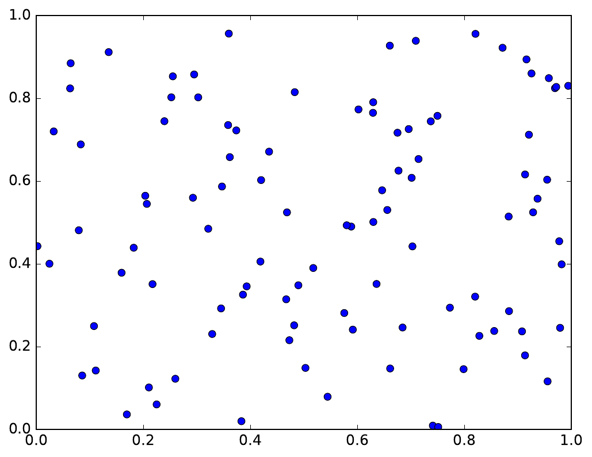
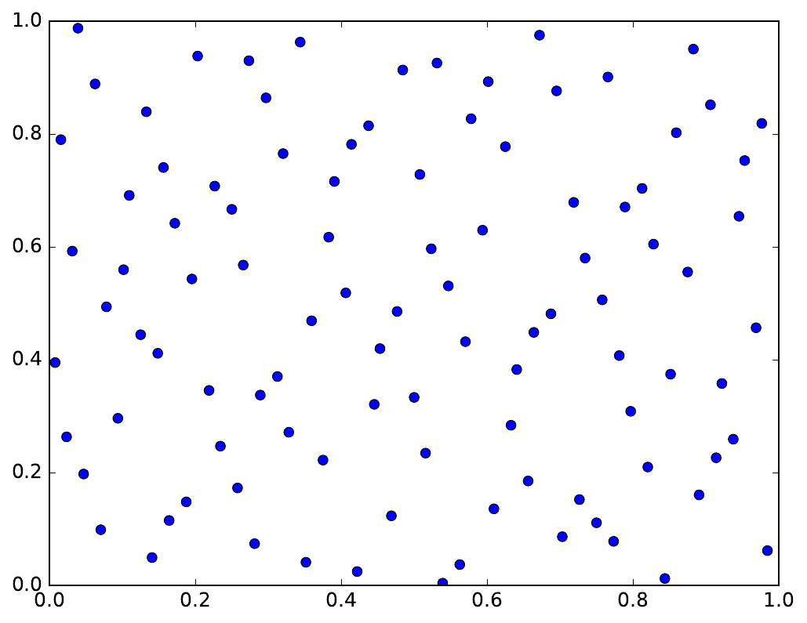

Can you guess which one is based on a low-discrepancy sequence and which on Monte Carlo sampling?

### Haselgrove sequence

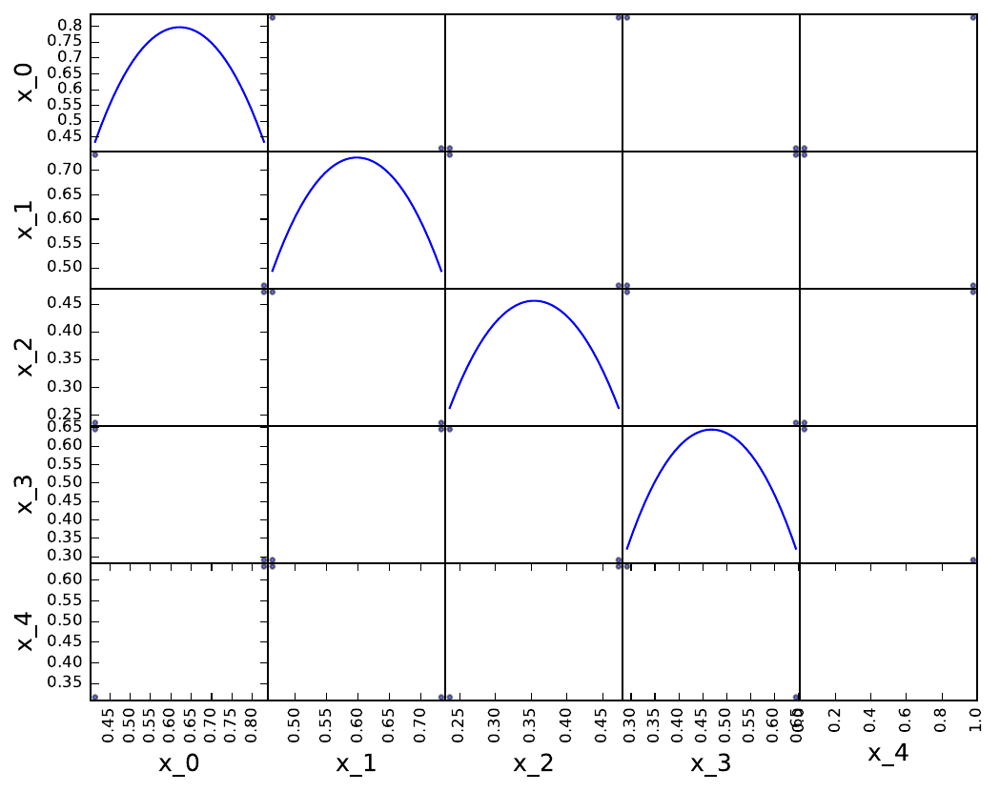
}
### Sobol' sequence

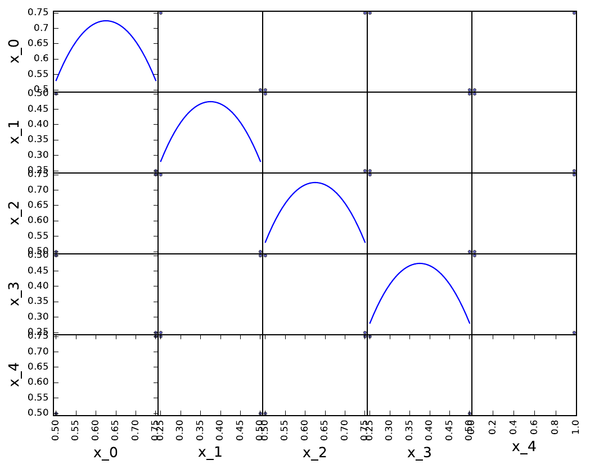

### Faure sequence

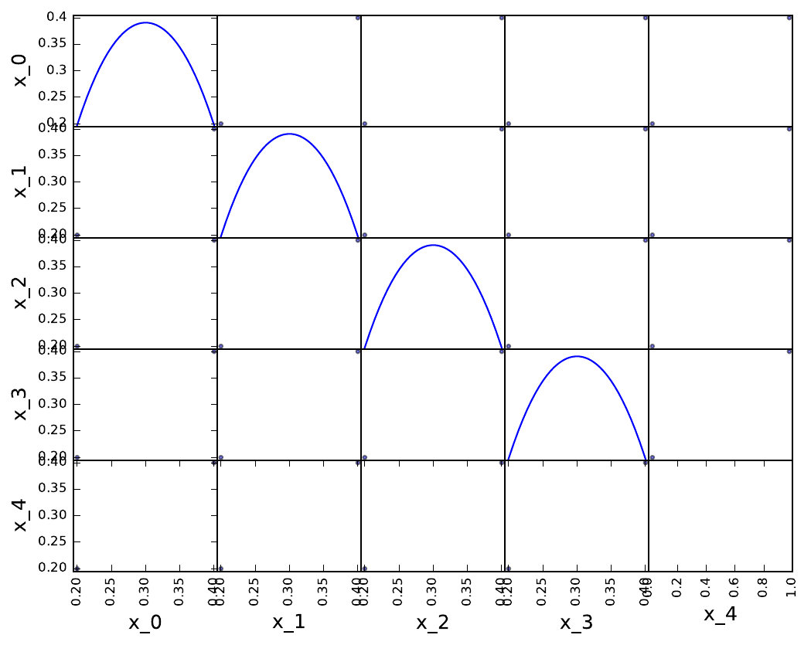

### Halton sequence

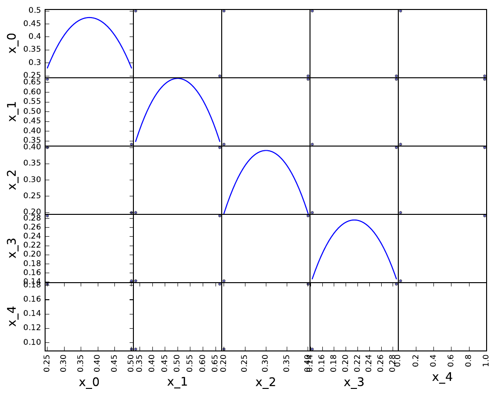

### Which sequence?
   
The performance of the low discrepancy sequences decreases fastly with the problem dimension:

- whatever the sequence,
- with a deterioration speed which depends on the sequence.

[On the OpenTURNS website](https://openturns.github.io/openturns/latest/theory/reliability_sensitivity/low_discrepancy_sequence.html), 
we can read recommendations for use:

| Sequence   | Dimension no greater than... |
|------------|------------------------------|
| Sobol      | several 100                  |
| Haselgrove | 50                           |
| Faure      | 25                           |
| Halton     | 8                            |

## Latin hypercube sampling (LHS)

### Standard

Stratified sampling strategy to increase the input parameter space coverage.
Based on dividing the range of each parameter into several intervals of equal probability.

1. Stratify the range of each parameter into $n$
   iso-probabilistic intervals. $\Rightarrow$ parameter space split into $n^d$ cells
2. Select a cell uniformly among all the available cells.
3. Select either the center of the cell or a point randomly in this cell.
4. Invert the Cumulative Density Function at the selected point.
5. Remove all the cells having a common strate with the previous cell from the list of available cells.
6. Go to 2. until the list is empty. 

With 2 variables:

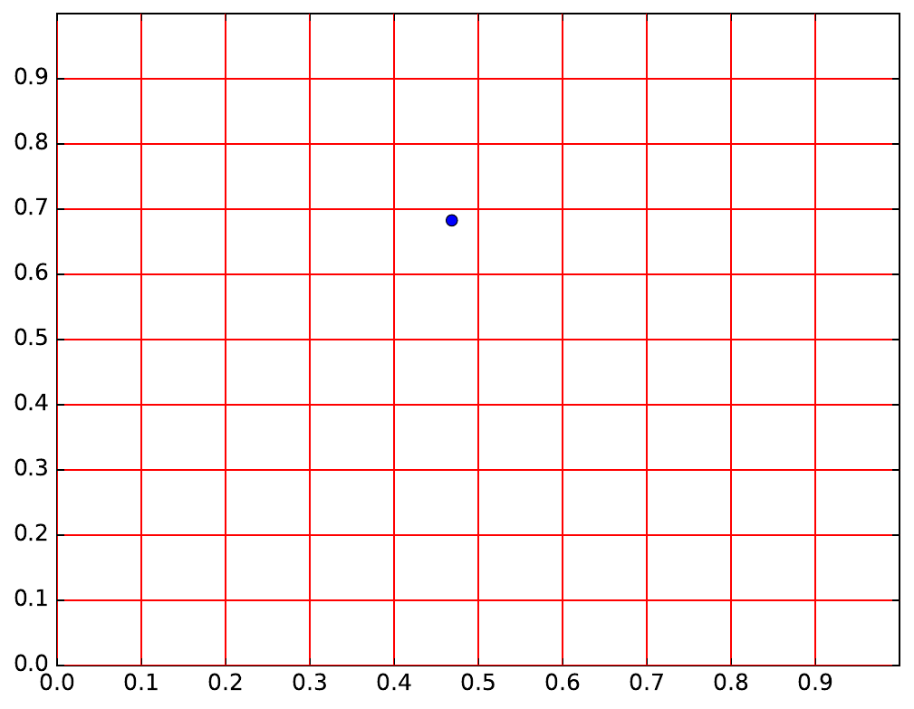

With 5 variables:

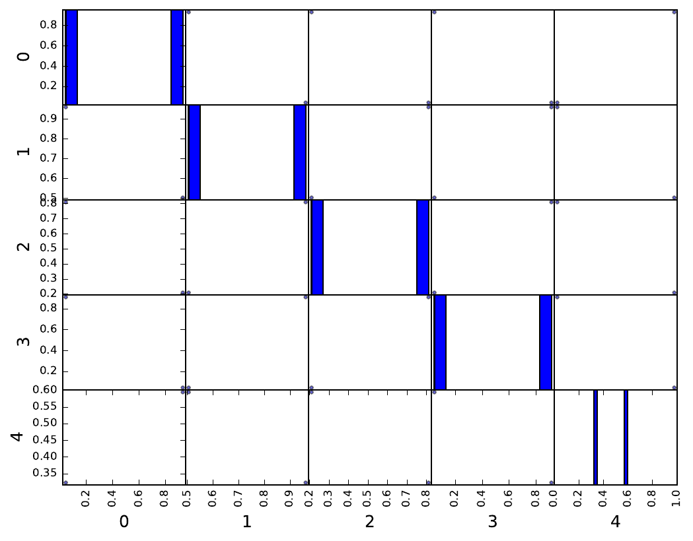

### Optimized

Two possibilities:

- Generate several LHS and select the one minimizing a discrepancy measure.
- Generate an initial LHS and embed it in a optimization loop (e.g. simulated annealing or genetic algorithm) to minimize a discrepancy measure.

See [this example](https://gemseo.readthedocs.io/en/develop/examples/doe/plot_lhs_example.html#sphx-glr-examples-doe-plot-lhs-example-py) in the GEMSEO documentation.