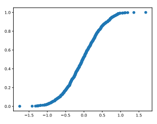
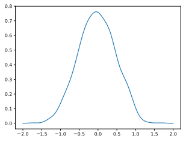
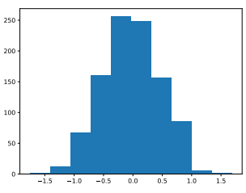
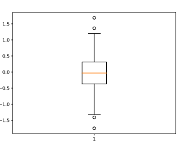
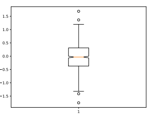

# 4. Uncertainty quantification

## Statistical measures (statistics)

### Expectation

The expectation is the first moment.

The expectation is the mean of $X$, *i.e.* its central trend:

$$\mu=\mathbb{E}[X]$$

$\forall (a,b)\in\mathbb{R}^2,~\mathbb{E}[aX+b]=a\mathbb{E}[X]+b$.

### Variance

The variance if the second central moment.

The variance is the mean squared dispersion of $X$ w.r.t. its central tendency:

$$\sigma^2=\mathbb{V}[X]=\mathbb{E}\left[\left(X-\mu\right)^2\right]=\mathbb{E}\left[X^2\right]-\mu^2$$

$\forall (a,b)\in\mathbb{R}^2,~\mathbb{V}[aX+b]=a^2\mathbb{V}[X]$.

### Standard deviation

The standard deviation is the square root of the variance:

$$\sigma=\sqrt{\mathbb{V}[X]}$$

!!! note

    $\sigma\equiv 0 \Leftrightarrow X$ is determinist.

### Coefficient of variation

The coefficient of variation is the standard deviation normalized by the expectation:

$$\texttt{CoV}=\frac{\sigma}{\mu}$$

### Moments

$\forall k\in\mathbb{N}^*$,

$$\gamma_k=\mathbb{E}\left[X^k\right]=\int_{\mathcal{X}}x^kf_X(x)dx$$

is called a moment,

$$m_{k,c}=\mathbb{E}\left[\left(X-\mathbb{E}[X]\right)^k\right]$$

is called a central moment and

$$m_{k,s}=\frac{\mathbb{E}\left[\left(X-\mathbb{E}[X]\right)^k\right]}{\mathbb{E}[(X-\mathbb{E}[X])^2]^{\frac{k}{2}}}$$

is called a standardized moment.

$m_{3,s}$ represents the [skewness](https://en.wikipedia.org/wiki/Skewness) of the distribution,
a measure of its asymmetry,
and $m_{4,s}$ represents its [kurtosis](https://en.wikipedia.org/wiki/Kurtosis), a measure of its "tailedness" .

Expectation and variance are the most popular moments.

## Monte Carlo sampling

### Introduction

Statistics are integral of quantify of interest.
For example, the expectation of the model output can be written as  

$$I=\mathbb{E}[f(X)]=\int_{\mathcal{X}}f(x)f_X(x)dx$$

Computing $I$ analytically is often impossible 
and a brute force approach is Monte Carlo (MC) sampling:

$$\hat{I}_N=\frac{1}{N}\sum_{i=1}^Nh\left(x^{(i)}\right)$$

where $x^{(1)},\ldots,x^{(N)}$ are $N$ independent realizations of $X$. 

### Properties

$\hat{I}_N$ tends to $I$ when $N$ tends to $\infty$
but with a slow convergence in the order of $1/\sqrt{N}$.
In other words,
dividing the error by $M$ implies to multiply the number of samples by $M^2$.
To be 10 times more precise, 100 times more evaluations are needed.

The convergence rate is independent of the dimension of $X$.
The only limitation to the use of a Monte Carlo estimator is the evaluation cost of $f$ 
not allowing a sufficient number of evaluations $N$ to achieve the desired accuracy of the MC estimator.

### Examples

Mean:

$$\mathbb{E}[h(X)]\approx\frac{1}{N}\sum_{i=1}^Nh\left(X^{(i)}\right)$$

Variance:

$$\mathbb{V}[h(X)]\approx\frac{1}{N}\sum_{i=1}^N\left(f\left(X^{(i)}\right)-\frac{1}{N}\sum_{j=1}^Nh\left(X^{(j)}\right)\right)^2$$

CDF

$$F_{f(X)}(y)\approx\frac{1}{N}\sum_{i=1}^N\mathrm{1}_{f\left(X^{(i)}\right)\leq y}=:\hat{F}_N(y)$$

Quantile

$$y_{\alpha}=\inf \left\{z:\hat{F}_N(y)\geq \alpha\right\}$$

Probability

$$\mathbb{P}[X\in\mathcal{D}]=\mathbb{E}[\mathrm{1}_{X\in\mathcal{D}}]\approx\frac{1}{N}\sum_{i=1}^N\mathrm{1}_{X^{(i)}\in\mathcal{D}}$$

!!! warning

    MC techniques for probabilities and quantiles are very costly,
    requiring $N=10^{r+2m}$ evaluations for a probability of $10^{-r}$ with a CoV of $10^{-m}$,
    e.g. $N=10^5$ evaluations for a probability of 99.9% with a CoV of 10%.

## Visualizing one 1D variable

Example with 1000 instances of a Gaussian variable with 0 mean and 0.5 standard deviation.

### Textual statistics

| name | value     |
|------|-----------|
| mean | -0.030262 |
| std  | 0.491196  |
| min  | -1.752956 |
| 25%  | -0.370826 |
| 50%  | -0.032611 |
| 75%  | 0.312060  |
| max  | 1.687337  |

### Empirical CDF plot

### Empirical PDF plot

We use a kernel-based estimator of the form:

$$F_N:x\mapsto\frac{1}{n}\sum_{i=1}^nK\left(\left\|x-x^{(i)}\right\|\right)$$

where $x^{(1)},\ldots,x^{(N)}$ are observations.

### Histogram

### Boxplot

- Box = [Quantile(25%),Median,Quantile(75%)] 
- Inter Quartile Range (IQR) = Quantile(75%)-Quantile(25%) 
- Whiskers = Median $\pm \kappa \times$ IQR
- Circles = outliers

### Notched boxplot

A notched boxplot is a boxplot with confidence interval for the median estimator.

## Visualizing several 1D variables

### Scatter matrix

### Cobwebplot

Also known as parallel coordinates.

